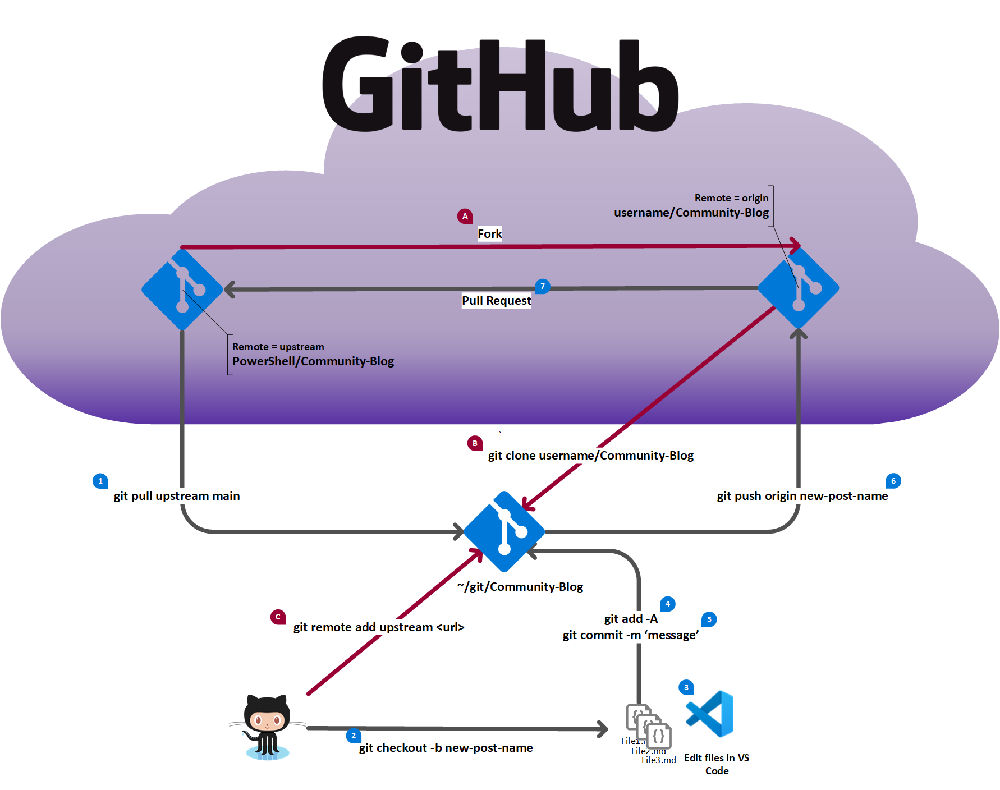

The following image illustrates the workflow for using Git and GitHub to create a new post for the
Community blog. The steps shown in red are a one-time action and are covered in
[Setup GitHub for local workflow](https://github.com/PowerShell/Community-Blog/wiki/Setup-GitHub-for-Local-Workflow).
The numbered steps (in black) are described in the table below.

| Steps| Description of steps         | Git command / GitHub actions                                                                                                                                       |
|------|------------------------------|--------------------------------------------------------------------------------------------------------------------------------------------------------------------|
| 0    | Checkout the main branch     | `git checkout main`                                                                                                                                                  |
| 1    | Sync the main branch         | `git pull upstream main` `git push origin main` |
| 2    | Create a new working branch  | git checkout -b new-post-name                                                                                                                                      |
| 3    | Create new content           | Use VS Code to create new blog post                                                                                                                                |
| 4-5  | Commit changes to local repo | `git add -A` `git commit -m 'commit message'`|
| 6    | Push working branch to fork  | git push origin new-post-name                                                                                                                                      |
| 7    | Submit pull request          | Go to `https://github.com/<your_github_username>/Community-Blog/pulls` and click the **New pull request** button.  `Base repository: PowerShell/Community-Blog base: main <-- head repository: <your_github_username>/Community-Blog compare: new-post-name`  Fill out the pull request description and click **Submit**. |
| 8    | PR is reviewed               | Make the necessary changes based on the review feedback.                                                                                                           |
| 9    | PR is merged                 | Go to step 10                                                                                                                                                      |
| 10   | Cleanup unneeded branch info | `git checkout main` `git push origin --delete new-post-name` `git branch -D new-post-name`  The `git push` command deletes the branch in your fork and deletes the tracking branch from your local repo. The `git branch` command delete the branch from your local repo. |
| 11   | Start new post               | Go to step 0                                                                                                                                                       |.