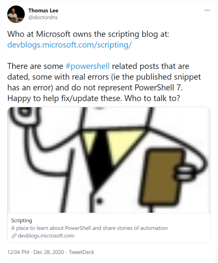

# Announcing the PowerShell Community Blog

We are proud to announce the a new blog dedicated to PowerShell and focused on the community. This
is a blog by the community and for the community. And we have made it easier than ever for you to
contribute to the new blog.

It all started with a generous [offer](https://twitter.com/doctordns/status/1343618958407168000)
from a member of he community, Thomas Lee ([@doctordns](https://twitter.com/doctordns)).

We knew we had a great opportunity here. But, rather than fixing the content in the Scripting blog,
what we really needed was a fresh start. So we decided to
[retire the Scripting blog](https://devblogs.microsoft.com/scripting/all-good-things-must-come-to-an-end/)
and create this new one.

## A blog for the community

Like the **Scripting** blog, this new blog is focused on teaching you about PowerShell, answering
your questions, and providing interesting and useful examples. We will continue to use the
[scripter@microsoft.com](mailto:scripter@microsoft.com?subject=Community%20Blog%20question") mailbox
to accept your questions. But there are new ways to engage with this blog.

## A blog by the community

On the **Scripting** blog, it was possible for members of the community to submit blog posts to our
email address. The Scripting Guys would review the offered content and publish the post for you.

With the new blog we have a new way to contribute. All posts to this blog are open-source markdown
files store in GitHub. You can share your own knowledge by submitting pull requests. And you can use
the Issues system to ask question, point out problems, or suggest ideas for new posts.

## Getting started

Thomas Lee already has several posts from the old Scripting blog that he has updated and corrected.
Look for those posts here in the coming weeks. If you have other posts from the old blog that you
would like to see updated, please open an issue in the
[Community-Blog](https://github.com/PowerShell/Community-Blog/issues) repository.

The content in the Scripting blog is not going away. But rather than updating the posts there, where
they will be lost among the 5400+ existing posts, the updated post will be published here as fresh
content that is easy to find.

So now it's your turn. Check out this [page]() to learn how to get started.
