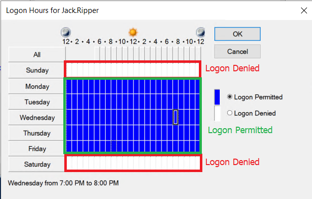
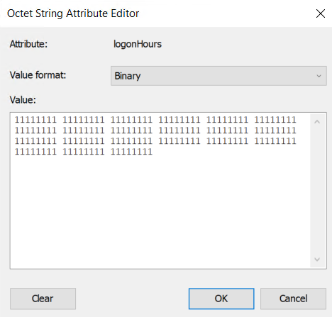
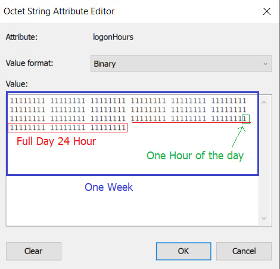
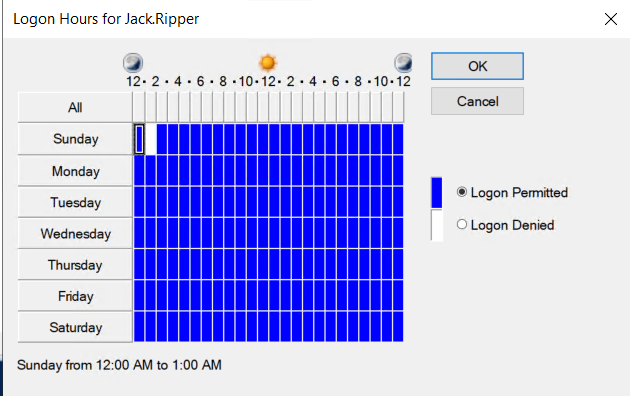
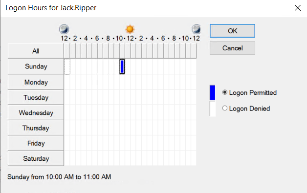
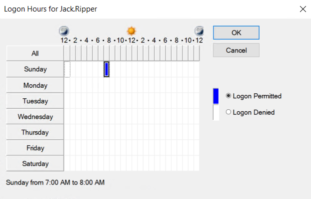

----
post_title: Manage Logon Hours via Windows PowerShell
username: farisnt@gmail.com
Catagories: PowerShell, Active Directory
Summary: How to change users Logon Hours using PowerShell
----

**Q:** How can I set AD domain user Logon Hours via Windows PowerShell ?

**A:** Most of the Active Directory object properties can be easily read or modified by using the `Get-` or `Set-` with the property name and its value, but when it comes to **LogonHours**, it not that easy.
There are multiple steps and challenges required to build the value, and in this tutorial, you will learn all the tips and tricks needed to set the **LogonHours** hours via Windows PowerShell.

## Logon Hours, Understanding the basics.

Let's start with the GUI of the Logon Hours window.
Opening any AD user account property —> **Account** Tab —> click on **Logon Hours**.
The default value is all blue, which means logon permitted.
If there is any white block, it means a logon denied on that selected time/day slot.

In the example below, the user cannot log in on Sunday or Saturday but can log in from Monday through Friday.



Logon Hours GUI

Ensure that the **Advanced Features** in Active Directory Management Console is checked to see the Attribute Editor.
Open the Active Directory console, click on **View** Menu, and select **Advanced Features**.

Start by opening any Active Directory user property —> **Attribute Editor** tab.
From the **Attributes Editor**, scroll to **LogonHours** and change the **Value Format** to **Binary.**.



Logon Hours in Binary

The value presented represents the logon hours.
This is undoubtedly not an understandable value, and it's not clear what this value means.

## Understanding LogonHours Property

In the **LogonHours**, each day of the week is represented by a three-byte (24-bit) field, with each bit representing one hour.



This user is allowed to login all the days though the week.

The below list explains more about the Bits, Bytes, and what each group represent.

- Each Bit represents one hour.
- Each Byte represents eight hours.
- Each three Byte represent One Day (24 Hour).
- 21 Byte represents one week.
- 168 bit represent one week in hours, which also mean one week has 168 Hour.

All the results in the property are based on UTC.

Changing any value from 1 to 0 or 0 to 1 is reflected in the Logon Hours GUI.
Change the first bit in the first block, make it 0, and then see the result.

In the first block, change the first bit to **01111111**, click on **OK** to save, and open back the Logon Hours in the **Account** tab for the same user.
Now there is one block that is now marked as white.



Result After Changing one bit

The result from your side may look may look different, so the logon denied hour may not be on Sunday 12 AM.
even after doing the same change.
This is because the **LogonHours** property uses UTC and **Logon Hours** GUI use the local timezone.
So this is an important consideration and we need to make sure that when the value is written, it should be in UTC.

## Parameters for the PowerShell Script.

To make things easy to use for the user, I wrote a function **Set-LogonHours** to set the AD user logon hours and respect the timezone bias.
This function accepts the following parameters.

- **Identity:** The Username of the target principal _(String, Position=0)_.
- **TimeIn24Format:** Array of the hours access is permitted _(Array, ValidateRange (0- 23)_.
- **Sunday:** Apply the TimeIn24Format to this day _(Switch)_.
- **Monday:** Apply the TimeIn24Format to this day _(Switch)_.
- **Tuesday:** Apply the TimeIn24Format to this day _(Switch)_.
- **Wednesday:** Apply the TimeIn24Format to this day _(Switch)_.
- **Thursday:** Apply the TimeIn24Format to this day _(Switch)_.
- **Friday:** Apply the TimeIn24Format to this day _(Switch)_.
- **Saturday:** Apply the TimeIn24Format to this day _(Switch)_.
- **NonSelectedDaysAre:** This option for the weekdays that are not selected, what the default value should be, is it a permit or denied _(ValidateSet ="WorkingDays" or "NonWorkingDays")_.

    ```powershell
    Set-LogonHours -identity "MyTestUser" -TimeIn24Format @(8,9,10,11,12)  -Monday -Tuesday -Wednesday -Thursday -NonSelectedDaysare WorkingDays
    ```

## Put it All in Action

First, create a Byte array to store the final result.
The array length is 21, which represents a week.
One thing to note that the **LogonHours** AD attribute accepts a Byte array, not an integer array.

```powershell
$FullByte=New-Object "byte[]" 21
```

Then create a Hashtable that represents each hour of the day.
The value of the hashtable items set to **One** based on the user input
The hashtable values are base on the user input, so if the user set the value **TimeIn24Format** to **@(8,9,10,11,12,13,14,15)**, the respected value in the Hashtable should be set to 1.

```powershell
$FullDay=[ordered]@{}
0..23 | foreach{$FullDay.Add($_,"0")}
$TimeIn24Format.ForEach({$FullDay[$_]=1})
```

Then join all the hashtable values together and store the result in a variable named `$Working`.

```powershell
        $Working= -join ($FullDay.values)
```

As the user selects the working days via switch parameters, what about the non-selected days?
What is the default value for the non-selected days? Permit login or denied login?
Whether the user chose to consider all the non-selected days a permitted login or denied login, the first **Switch** set the default value for the weekdays.
The Second **Switch** statement will fill the user added weekdays parameter value with the allowed logon hours.

```powershell
Switch ($PSBoundParameters["NonSelectedDaysare"])
       
        {
            'NonWorkingDays' {$SundayValue=$MondayValue=$TuesdayValue=$WednesdayValue=$ThursdayValue=$FridayValue=$SaturdayValue="000000000000000000000000"} 
            'WorkingDays' {$SundayValue=$MondayValue=$TuesdayValue=$WednesdayValue=$ThursdayValue=$FridayValue=$SaturdayValue="111111111111111111111111"}
        }
Switch ($PSBoundParameters.Keys)
                {
                    'Sunday' {$SundayValue=$Working}
                    'Monday' {$MondayValue=$Working}
                    'Tuesday' {$TuesdayValue=$Working}
                    'Wednesday' {$WednesdayValue=$Working}
                    'Thursday' {$ThursdayValue=$Working}
                    'Friday' {$FridayValue=$Working}
                    'Saturday' {$SaturdayValue=$Working}
                    
                }
```

The next line is to build up the full week string by combining all the values in one row.
This includes the hashtable values and the **NonSelectedDaysare**, which is required for fixing the time zone offset.
This makes the script can give the same result regardless of the time zone.

```powershell
$AllTheWeek="{0}{1}{2}{3}{4}{5}{6}" -f $SundayValue,$MondayValue,$TuesdayValue,$WednesdayValue,$ThursdayValue,$FridayValue,$SaturdayValue
```

## Timezone Challenge and Bits Shifting.

The **LogonHours** value should base on UTC, and this led to the following possible scenarios:

- **Scenarios 1**: The user is located in a minus time zone range like US, Canada with -8 Hours UTC.
- **Scenarios 2**: The user is located in zero time zone range, such as Dublin, London +00 UTC.
- **Scenarios 3**: The User is located in a plus  time zone such as Bangkok, Hanio, Jakarta +7 UTC.

To see and understand the challenge, let's see it first in action to know how to build the solution.
Set the time zone to any time zone with 0 UTC, such as London, Dublin. **0 UTC**.
Then change the **Logon Hours** window for a test user to only allow a login for one hour as the following.
This helps in seeing how this bit is moving after changing the time zone



Only One hour is selected

Change the Timezone to -2 or -3, such as (**UTC - 03:00) Salvador.** Open the same **Logon Hours** GUI interface again and see where the permitted login slot is now shifted.



The bit is shifted 3 bits to the left

The same thing happens if the selected timezone was **(UTC +)**, the permit login slot is shift to the right.
Timezone bias change should be reflected in the order of the bits, so the result is always correct.

In PowerShell, using the `Get-Timezone` cmdlet will read the current time zone information.
The `Get-Timezone` contains a property which shows the Timezone bias `(Get-TimeZone).baseutcoffset.hours`.
It's possible to change the order of the bits based on the Timezone bais.

```powershell
# Timezone in UTC -
If ((Get-TimeZone).baseutcoffset.hours -lt 0){
$TimeZoneOffset = $AllTheWeek.Substring(0,168+ ((Get-TimeZone).baseutcoffset.hours))
$TimeZoneOffset1 = $AllTheWeek.SubString(168 + ((Get-TimeZone).baseutcoffset.hours))
$FixedTimeZoneOffSet="$TimeZoneOffset1$TimeZoneOffset"
}
# Timezone is UTC +
If ((Get-TimeZone).baseutcoffset.hours -gt 0){
$TimeZoneOffset = $AllTheWeek.Substring(0,((Get-TimeZone).baseutcoffset.hours))
$TimeZoneOffset1 = $AllTheWeek.SubString(((Get-TimeZone).baseutcoffset.hours))
$FixedTimeZoneOffSet="$TimeZoneOffset1$TimeZoneOffset"
}
# Timezone is UTC 0
if ((Get-TimeZone).baseutcoffset.hours -eq 0){
$FixedTimeZoneOffSet=$AllTheWeek
}
```

## Building the Final Byte array and setting the values

Now the hours are aligned with the time zone bias, and it's time to build the array and convert the string to a byte array.
The result is stored in a variable named `$FixedTimeZoneOffset`, and it should be split into a group of 8 characters for converting it to Byte later.

Another challenge is each 8 bits group needs to have a reverse order, so the 1's and 0's order reflects the correct binary number bits order, then update the result in the `$FullByte` variable, which will be used to update the AD user information by using **Set-ADUser** cmdlet.

```powershell
$BinaryResult=$FixedTimeZoneOffSet -split '(\d{8})' | where {$_ -match '(\d{8})'}

                    Foreach($singleByte in $BinaryResult){
                        $Tempvar=$singleByte.tochararray()
                        [array]::Reverse($Tempvar)
                        $Tempvar= -join $Tempvar
                        $Byte = [Convert]::ToByte($Tempvar, 2)
                        $FullByte[$i]=$Byte
                        $i++

                        }

           Set-ADUser  -Identity $Identity -Replace @{logonhours = $FullByte}
```

## All the PowerShell Script.

```powershell
Function Set-LogonHours{
[CmdletBinding()]
Param(
[Parameter(Mandatory=$True)]
[ValidateRange(0,23)]
$TimeIn24Format,
[Parameter(Mandatory=$True,
          ValueFromPipeline=$True,
          ValueFromPipelineByPropertyName=$True, 
          Position=0)]$Identity,
[parameter(mandatory=$False)]
[ValidateSet("WorkingDays", "NonWorkingDays")]$NonSelectedDaysare="NonWorkingDays",
[parameter(mandatory=$false)][switch]$Sunday,
[parameter(mandatory=$false)][switch]$Monday,
[parameter(mandatory=$false)][switch]$Tuesday,
[parameter(mandatory=$false)][switch]$Wednesday,
[parameter(mandatory=$false)][switch]$Thursday,
[parameter(mandatory=$false)][switch]$Friday,
[parameter(mandatory=$false)][switch]$Saturday

)

Process{
$FullByte=New-Object "byte[]" 21

$FullDay=[ordered]@{}
0..23 | foreach{$FullDay.Add($_,"0")}

        Foreach ($singlevalue in $TimeIn24Format){
        $FullDay[$singlevalue]=1

        }
        $Working= -join ($FullDay.values)
        
        Switch ($PSBoundParameters["NonSelectedDaysare"])
       
        {
            'NonWorkingDays' {$SundayValue=$MondayValue=$TuesdayValue=$WednesdayValue=$ThursdayValue=$FridayValue=$SaturdayValue="000000000000000000000000"} 
            'WorkingDays' {$SundayValue=$MondayValue=$TuesdayValue=$WednesdayValue=$ThursdayValue=$FridayValue=$SaturdayValue="111111111111111111111111"}
        }

         Switch ($PSBoundParameters.Keys)
                {
                    'Sunday' {$SundayValue=$Working}
                    'Monday' {$MondayValue=$Working}
                    'Tuesday' {$TuesdayValue=$Working}
                    'Wednesday' {$WednesdayValue=$Working}
                    'Thursday' {$ThursdayValue=$Working}
                    'Friday' {$FridayValue=$Working}
                    'Saturday' {$SaturdayValue=$Working}
                    
                }
        $AllTheWeek="{0}{1}{2}{3}{4}{5}{6}" -f $SundayValue,$MondayValue,$TuesdayValue,$WednesdayValue,$ThursdayValue,$FridayValue,$SaturdayValue

# Timezone Check
                    if ((Get-TimeZone).baseutcoffset.hours -lt 0){
                    $TimeZoneOffset = $AllTheWeek.Substring(0,168+ ((Get-TimeZone).baseutcoffset.hours))
                    $TimeZoneOffset1 = $AllTheWeek.SubString(168 + ((Get-TimeZone).baseutcoffset.hours))
                    $FixedTimeZoneOffSet="$TimeZoneOffset1$TimeZoneOffset"
                    }

                    if ((Get-TimeZone).baseutcoffset.hours -gt 0){
                    $TimeZoneOffset = $AllTheWeek.Substring(0,((Get-TimeZone).baseutcoffset.hours))
                    $TimeZoneOffset1 = $AllTheWeek.SubString(((Get-TimeZone).baseutcoffset.hours))
                    $FixedTimeZoneOffSet="$TimeZoneOffset1$TimeZoneOffset"
                    }

                    if ((Get-TimeZone).baseutcoffset.hours -eq 0){
                    $FixedTimeZoneOffSet=$AllTheWeek
                    }

                    $i=0
                    $BinaryResult=$FixedTimeZoneOffSet -split '(\d{8})' | Where {$_ -match '(\d{8})'}

                    Foreach($singleByte in $BinaryResult){
                        $Tempvar=$singleByte.tochararray()
                        [array]::Reverse($Tempvar)
                        $Tempvar= -join $Tempvar
                        $Byte = [Convert]::ToByte($Tempvar, 2)
                        $FullByte[$i]=$Byte
                        $i++

                        }

           Set-ADUser  -Identity $Identity -Replace @{logonhours = $FullByte}             
                        
}
end{
Write-Output "All Done :)"
}

}

# Change the LogonHours for all the users in the Test OI
Get-ADUser -SearchBase "OU=Test,DC=test,DC=local" -Filter *| Set-LogonHours -TimeIn24Format @(8,9,10,11,12,13,14,15,16)  -Monday -Tuesday -Wednesday -Thursday -NonSelectedDaysare WorkingDays 
# Change the LogonHours for a single user
Set-LogonHours -Identity Jack.Ripper -TimeIn24Format @(1,2,3,4,5,6,7,8,9,10,11,12,13,14,15,16,17,18,19,20,21,22,23,0) -Monday -Tuesday -Wednesday -Thursday -Friday -NonSelectedDaysare NonWorkingDays # Allow Access during weekday
```
