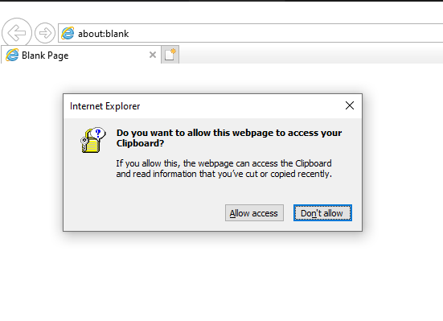

**Q:** Hey I have a fun question! I remember reading a while back about using
VBScript to paste to the clipboard.  Are we able to do that with PowerShell?

**A:** Why yes, yes we can!  It is far often a much quicker solution if we
start with PowerShell!

## Pasting content to the clipboard, the old VBScript method

Before we show the quick and easy solution, let's learn how we could adapt an
older solution.

Now back in the day if I wanted to paste something on the clipboard I would go
down to the store, get some glue and....

"DOH! Wrong Clipboard!" (Knew I should have splashed some water on my face
before typing this up!)

What I should have said was back before PowerShell existed we actually had TWO
methods to paste text data to the clipboard.

One was a nice simple solution if you were working in DOS or has simple text
output from a VBScript.  You would pipe the output to the `clip` command as
seen below

```output
dir | clip
```

Once this was complete you could paste your captured text using a `CTRL-V` in
whichever Windows application.

Another method that presented itself was using some code such as this in
VBScript

```VBScript
strCopy = "This text has been copied to the clipboard."
Set objIE = CreateObject("InternetExplorer.Application")
objIE.Navigate("about:blank")
objIE.document.parentwindow.clipboardData.SetData "text", strCopy
objIE.Quit
```

So I could re-use this solution in PowerShell quite easily.   I do this in case
you might ever see some older VBScript that you might want to reuse.

The first line in VBScript is assigning a string

```VBScript
strCopy = "This text has been copied to the clipboard."
```

In PowerShell I can do this in the following manner.

```powershell
$strCopy = "This text has been copied to the clipboard."
```

The next line is where a Comobject is created.

```VBScript
Set objIE = CreateObject("InternetExplorer.Application")
```

The equivalent code in PowerShell to do the same thing and even use the same
variable name for the object would be

```powershell
$objIE = New-Object -comobject "InternetExplorer.Application"
```

Then from this point the final lines are just manipulating data in the Object.

```VBScript
objIE.Navigate("about:blank")
objIE.document.parentwindow.clipboardData.SetData "text", strCopy
objIE.Quit
```

Which in PowerShell would look like this.

```powershell
$objIE.Navigate("about:blank")
$objIE.document.parentwindow.clipboardData.SetData("text", strCopy)
$objIE.Quit
```

However if you try this solution in a modern version of Windows, it will appear
to just sit and hang in PowerShell.

We can one extra line to the original code and you see why.

```powershell
$objIE.Navigate("about:blank")

# Show the hidden Internet Explorer background application
$objIE.Visible=$True

$objIE.document.parentwindow.clipboardData.SetData("text", strCopy)
$objIE.Quit
```

The following Window below demonstrates why the old solution, even when
converted to PowerShell failed.



In fact, even if we just ran it in vbScript today, it would have failed in an
equal manner.

## The drawback to converting from VBScript

So that was pretty cool, you tried to re-use some VBScript to meet your task.  
In this case because security has improved in past 17 years, Internet Explorer
is not allowed to just paste things to the clipboard.

But although this is a nice way to learn how to convert over some older code
from VBScript, it is actually not a good used of PowerShell for two reasons.

1. It leverages Internet Explorer which, for this purpose, is a big resource
to solve the problem at hand. We can also no longer automate in this manner.
1. PowerShell has built in cmdlets to solve the problem which are far easier
to use.  They not only work well in Windows PowerShell, but also just as
seamlessly across all supported Operating Systems when using PowerShell 7.x

## The clipboard cmdlets in PowerShell

You can verify they exist by just using `Get-Command` like the sample below

```output
Get-Command *clipboard*

CommandType     Name            Version    Source
-----------     ----            -------    ------
Cmdlet          Get-Clipboard   7.0.0.0    Microsoft.PowerShell.Management
Cmdlet          Set-Clipboard   7.0.0.0    Microsoft.PowerShell.Management
```

To populate the clipboard with a directory structure, as an example, I can
execute the following line

```output
PS> Get-Childitem | Set-Clipboard
```

There is no visual output because the data is now stored on the Clipboard.

To verify this in PowerShell you can use the `Get-Clipboard` Cmdlet.

```output
PS> Get-Clipboard
C:\Demo\AzureADBaseline
C:\Demo\AzureDSC
C:\Demo\AzureVM-Json
C:\Demo\DualStateMitigate
C:\Demo\testmoduleforme.ps1
C:\Demo\TheShellofBlueness.docx
```

So yes, I wasted a bit of time showing you how to convert some VBScript.
Please have pity on me for my intent was good. Shame on me. :)

## Summary

It is nice to know that you can convert over to PowerShell in a pretty
simple manner from vbScript if you needed to.  There are a lot of excellent
examples of how to manage Windows environments with VBScript readily written.

It is equally important to understand why we would choose to start fresh with
the solution in PowerShell.  

It gives us a solution, in this case of manipulating the clipboard in an
Operating System; which is consistent across the board whether you choose to
use Windows, MacOS, Linux or any supported Operating System for PowerShell 7.x.

The choice is yours my friends!

## Tip of the Hat

This article was based on one written back on older post on
["Can I Copy Script Output to the Clipboard"](https://devblogs.microsoft.com/scripting/can-i-copy-script-output-to-the-clipboard/)

I do not recall the author but it was a good way to learn how to
programmatically set the clipboard back then.  It was time to get it updated.

Cheers all!  Your friend in Automation
Sean Kearney - Customer Engineer/Microsoft - @PowerShellMan

_"Remember with great PowerShell comes great responsibilty..."_
