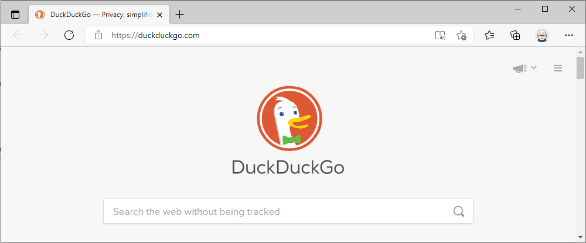

**Q:** How can I change the Edge startup page?

**A:** You can change the start page easily using PowerShell.

## Edge and It's Start Page

I am basing this article on the latest incarnation of the Edge browser, aka Edge Chromium.
The settings in this article seem to work fine on the latest versions of Windows 10 and Server 2022.
Other browsers can have different approaches to startup page.
And as ever - E&OE!

When the Edge browser starts up, it displays a startup page based on Bing by default.
For many, this is fine - they can browse the contents and then navigate where they want.
But in some circumstances, you may wish to change this default.
And fortunately, this is straightforward to achieve.

An easy way to set the startup page for yourself is to configure two registry value entries on the local machine.
The first is the **RestoreOnStartup** value entry to the registry key `HKCU:\\Software\\Policies\\Microsoft\\Edge`.
This value entry is a **REG_DWORD**.
By setting this entry with a value of **4**, you tell Edge to use the URL or URLs you specify when it starts up rather than the default home page.

The second value entry (or entries) is within the key `HKCU:\\Software\\Policies\\Microsoft\\Edge\\RestoreOnStartupURLs`.
This value entry (or entries) contains the URL (or URLS) you want Edge to open at startup.
In most cases, you would setup a single URL under this key, but you can set more to have Edge bring up multiple pages at startup.

Each registry value entry must have a unique entry name and contain the value of a URL you want Edge to restore at startup.
The value entry name doesn't seem to matter, so a value of **1** is fine.
If you want a second URL, then add a second value entry with a name of **2** (and the value of the second URL).

Creating and setting these keys and key values as shown below enables the current user's settings.
If you are sharing the host with multiple users and want all users to have the same start page, you can set these entries in `HKCU:\\Software\\Policies` instead.

## Configuring Edge Chromium Home Page

You have choices as to what page of pages Edge opens when it starts. 
You could choose a corporate Intranet landing page or perhaps a SharePoint project site.
You could also the startup page to a different search engine home page, such as Duck Duck Go.
As noted above, you can configure multiple startup pages should that be useful.

With PowerShell, you use the `New-Item` cmdlet to create the registry keys.
It also makes sense to test whether the keys exist before trying to create them (and generating an error).
You set the value entries using the `Set-ItemProperty` cmdlet.

The following code snippet sets the default home page for the current user for Edge Chromium to [DudkDuckGo](https://duckduckgo.com/).

```powershell
# Ensure Edge key exists
$EdgeHome = 'HKCU:\\Software\\Policies\\Microsoft\\Edge'
If ( -Not (Test-Path $EdgeHome)) {
  New-Item -Path $EdgeHome | Out-Null
}
# Set RestoreOnStartup value entry
$IPHT = @{
  Path   = $EdgeHome 
  Name   = 'RestoreOnStartup' 
  Value  = 4 
  Type   = 'DWORD'
}
Set-ItemProperty @IPHT -verbose
# Create Startup URL's registry key
$EdgeSUURL = "$EdgeHome\\RestoreOnStartupURLs"
If ( -Not (Test-Path $EdgeSUURL)) {
  New-Item -Path $EdgeSUURL | Out-Null
}
# Create a single URL startup page
$HOMEURL = 'https://duckduckgo.com'
Set-ItemProperty -Path $EdgeSUURL -Name '1' -Value $HomeURL
```

The next time you start Edge, you should see this:




## There are other ways

As ever with PowerShell, there are other ways you could change start page for Edge.
You can [use the browser itself as described in a Microsoft suuport article](https://support.microsoft.com/en-us/microsoft-edge/change-your-browser-home-page-a531e1b8-ed54-d057-0262-cc5983a065c6).
As ever, you coulkd set the registry settings using WMI.
And, last but not least, it's [straightforward to set the browser's start page via group policy](https://admx.help/?Category=Windows_10_2016&Policy=Microsoft.Policies.MicrosoftEdge::HomePages).

## Summary

It is easy to change the start page for the Edge web browser
you just have to set a fewe registry keys and job done.

## Tip of the Hat

I based this article on one written for the earlier Scripting Guys blog [How Can I Change the Internet Explorer Home Page?](https://devblogs.microsoft.com/scripting/how-can-i-change-the-internet-explorer-home-page/).
I don't know the author. 
