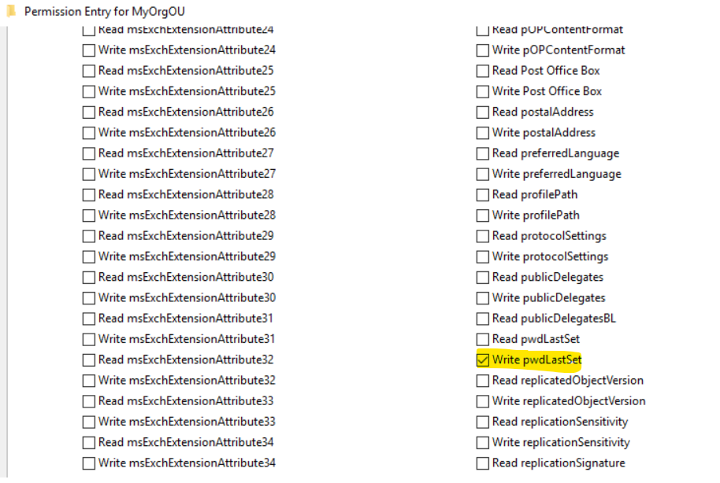
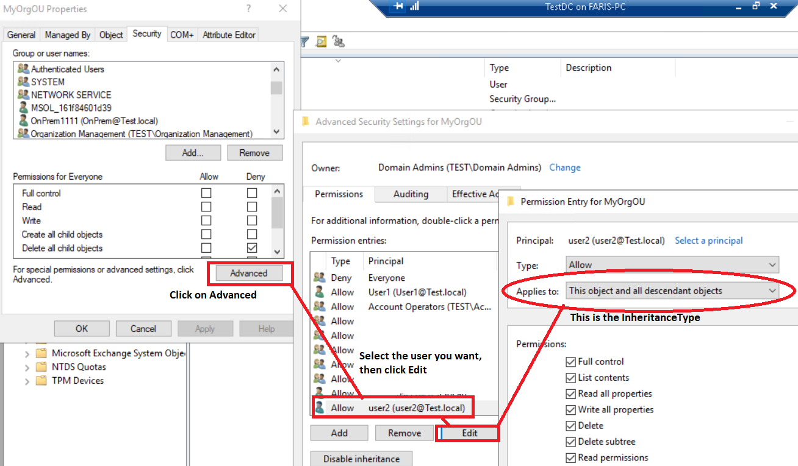
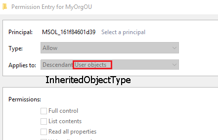
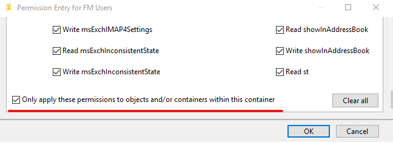

## Understanding `Get-ACL` and AD: Drive Output

Understanding Active Directory ACL using PowerShell can be a bit tricky.
There are no out-of-the-box cmdlets with ActiveDirectory PowerShell module to help in settings the permission quickly.
While there are no cmdlets, you can nevertheless manage AD permissions using the AD PowerShell drive.

In this post, I will try to simplify Active Directory ACL and how to read the result easily, so let's start.

## Prerequisites

To follow along with this article, you need the following:

- PowerShell 7. x or Windows PowerShell 5.1
- A user account that is member of Domain Admin AD Group.
- Windows Server 2012, 2016, 2019 or 2022 with Active Directory Domain Service role installed and participating in a domain.

The domain name used for this tutorial is **Contoso.com**.

## Reading Active Directory Permission using `Get-ACL`

Reading Active Directory permission using `Get-ACL` doesn't require a long line of code.
However, we are reading from AD and not the FileSystem provider. So we use the `AD:` drive. This drive is automatically loaded when you load the ActiveDirectory module.

[alert type="note" heading="Note"]To import Active Directory Module, use the `Import-Module ActiveDirectory`.[/alert]

When you query for an object to get its ACL, you need to search based on **Distinguished Name**.
Use the following statement to get the ACL for the **MyOrgOU** organization unit in the **Contoso.com**.

```powershell-console
PS> (Get-Acl -Path "AD:OU=MyOrgOU,DC=Contoso,DC=com").Access

ActiveDirectoryRights : CreateChild, DeleteChild
InheritanceType       : None
ObjectType            : bf967aba-0de6-11d0-a285-00aa003049e2
InheritedObjectType   : 00000000-0000-0000-0000-000000000000
ObjectFlags           : ObjectAceTypePresent
AccessControlType     : Allow
IdentityReference     : BUILTIN\\Account Operators
IsInherited           : False
InheritanceFlags      : None
PropagationFlags      : None
.
.
Output Trimmed to make the result clear.
```

As the output shows, there are multiple properties, but some are not obvious in terms of their usage.
You can tell from the first view is that there is a **CreateChild** and **DeleteChild** permission assigned to the **BUILTIN\\Account Operators**.
But on which object (User, Computer...etc) and which AD attribute?
Let's take another example.
You created user **User1** and assigned permission on **MyOrgOU** organizational unit by another administrator.
Using the `Get-ACL` cmdlet, return the following results.

```powershell-console
PS> (Get-Acl -Path "AD:OU=MyOrgOU,DC=Contoso,DC=Com").Access | Where-Object {$_.IdentityReference -Like "Contoso\\User1"}

ActiveDirectoryRights : WriteProperty
InheritanceType       : Descendents
ObjectType            : 28630ebf-41d5-11d1-a9c1-0000f80367c1
InheritedObjectType   : bf967aba-0de6-11d0-a285-00aa003049e2
ObjectFlags           : ObjectAceTypePresent, InheritedObjectAceTypePresent
AccessControlType     : Allow
IdentityReference     : Contoso\\User1
IsInherited           : False
InheritanceFlags      : ContainerInherit
PropagationFlags      : InheritOnly
```

Same as the first case, the question is what **Contoso\\User1** actually has permission to do?

## Understanding the Get-ACL and AD Drive Output

To make things easier, let's start by understanding each property of the output and what that property does..

### Understanding the ActiveDirectoryRights Property

- **ActiveDirectoryRights**: The **ActiveDirectoryRights** refer to what rights are assigned to the AD object;
usually, this is readable, like **WriteProperty**, **DeleteProperty**.
But this is not always the case.
The **ActiveDirectoryRights** can also hold **ExtendedRights**, **Generic**, and other values.

[alert type="note" heading="Note"]You can read more about **ActiveDirectoryRights** on the [ActiveDirectoryRights](https://docs.microsoft.com/en-us/dotnet/api/system.directoryservices.activedirectoryrights?view=net-5.0) page.[/alert]

- The **ExtendedRight** flag means permission is set to a very specific AD object attribute, such as setting the write _pwdLastSet_ to a AD user object attribute.
        
- **Generic**: Some generic permission values include
  - **GenericAll**: Equivalent to Full Control, so the user with *GenericAll* has full control permission on the object.
  - **GenericRead**: Can read all object properties and permission and list content if its a container or OU.
  - **GenericWrite**: Can write to all object's properties and permission.

## Understanding the InheritanceType Property

The **InheritanceType** shows the scope of the applied permission and defines which AD objects the ACE should 
 be applied to.
You can see the **InheritanceType** in the ACL GUI in the Advance Security Permission Window.


The **InheritanceType** can hold one of the following values:
    - **None**: The permission is applied to the object where the permission is set.
The **Applies to** is set to **This Object Only**
    - **All**: The permission is applied to the object where the permission is set and all the child items in the tree.
The **Applies to** is set to **This object and all descendant objects**.
    - **Descendents**: The permission is applied to child items only but not to the object where the permission is set.
The **Applies to** is set to **All descendant objects**.
Think of **OU1** and a child **OU2**.
**User1** has the following permission on **OU1**

```powershell-console
    PS> (Get-Acl -Path "AD:OU=OU1,DC=Contoso,DC=Com").Access | Where-Object {($_.IdentityReference -Like "*User1*")}

    ActiveDirectoryRights : GenericAll
    InheritanceType       : Descendents
    ObjectType            : 00000000-0000-0000-0000-000000000000
    InheritedObjectType   : 00000000-0000-0000-0000-000000000000
    ObjectFlags           : None
    AccessControlType     : Allow
    IdentityReference     : Contoso\\User1
    IsInherited           : False
    InheritanceFlags      : ContainerInherit
    PropagationFlags      : InheritOnly
```

User1 can perform an action on **OU2** and **OU1** child items but not on the **OU1** object.

- **Children**: set permissions on the direct child only, not the on the object itself neither any descendants object of its children.
You get this value when the **Applies to** set to any value other than **This object only** or **This object and all descendant objects** and at the same time the **Only apply this permission to objects and/or containers within this container** check box is selected.
- **SelfAndChildren**: Set permissions on the object itself where the permission is placed and the direct child only.
You get this value when the **Applies to** set to value **This object and all descendant objects** and at the same time the **Only apply this permission to objects and/or containers within this container** check box is selected.

### Understanding the ObjectType Property

The **ObjectType** is represented by a GUID value, even though this is one of the most important values that should be clear.
The output of `Get-ACL` makes it complex to understand.
The **ObjectType** is the object attribute. For example, in the following output, **User1** is **Allowed** to **WriteProperty** to object **28630ebf-41d5-11d1-a9c1-0000f80367c1**.

```powershell-console
PS> (Get-Acl -Path "AD:OU=MyOrgOU,DC=Contoso,DC=Com").Access | where-Object {$_.IdentityReference -Like "Contoso\\user1"}

ActiveDirectoryRights : WriteProperty
InheritanceType       : Descendents
ObjectType            : 28630ebf-41d5-11d1-a9c1-0000f80367c1
InheritedObjectType   : bf967aba-0de6-11d0-a285-00aa003049e2
ObjectFlags           : ObjectAceTypePresent, InheritedObjectAceTypePresent
AccessControlType     : Allow
IdentityReference     : Contoso\\User1
IsInherited           : False
InheritanceFlags      : ContainerInherit
PropagationFlags      : InheritOnly
```

To resolve this GUID to a name we need to see where these GUIDs are stored.

To get the list of *ObjectType* names, run the following PowerShell code

```powershell
$ObjectTypeGUID = @{}


$GetADObjectParameter=@{
    SearchBase=(Get-ADRootDSE).SchemaNamingContext
    LDAPFilter='(SchemaIDGUID=*)'
    Properties=@("Name", "SchemaIDGUID")
}

$SchGUID=Get-ADObject @GetADObjectParameter
    Foreach ($SchemaItem in $SchGUID){
    $ObjectTypeGUID.Add([GUID]$SchemaItem.SchemaIDGUID,$SchemaItem.Name)
}

$ADObjExtPar=@{
    SearchBase="CN=Extended-Rights,$((Get-ADRootDSE).ConfigurationNamingContext)"
    LDAPFilter='(ObjectClass=ControlAccessRight)'
    Properties=@("Name", "RightsGUID")
}

$SchExtGUID=Get-ADObject @ADObjExtPar
    ForEach($SchExtItem in $SchExtGUID){
    $ObjectTypeGUID.Add([GUID]$SchExtItem.RightsGUID,$SchExtItem.Name)
}

$ObjectTypeGUID | Format-Table -AutoSize
```

Take a look at the output, you see that there is the ObjectType GUID and the Name what an ObjectType GUID. 

```powershell-console
Name                                 Value                                                           
----                                 -----                                                           
a8032e74-30ef-4ff5-affc-0fc217783fec NisNetgroupTriple                                               
5b7eae84-7e67-4d56-8fca-9cee24d19a65 ms-Exch-Policy-Tag-Link                                         
5245803a-ca6a-11d0-afff-0000f80367c1 NTFRS-Replica-Set                                               
52458038-ca6a-11d0-afff-0000f80367c1 Admin-Property-Pages                                            
52458039-ca6a-11d0-afff-0000f80367c1 Shell-Property-Pages                                            
296de070-b098-11d2-aa06-00c04f8eedd8 ms-Exch-Server2-Page-Size                                       
203d2f32-b099-11d2-aa06-00c04f8eedd8 ms-Exch-Source-BH-Address                                       
b8d47e4e-4b78-11d3-aa75-00c04f8eedd8 ms-Exch-Security-Password                                       
b8fe00a9-8e59-4d4d-8939-85b79de4d8cf ms-Exch-Provisioning-Flags                                      
4d7ea1cd-43a0-4255-9bb0-12f17be23ffb ms-Exch-ESE-Param-Replay-Background-Database-Maintenance-Delay  
2dbb448a-5d85-4144-a9a5-2fc724e194a8 ms-Exch-Auto-Discover-Flags                                     
e85e1204-3434-41ad-9b56-e2901228fff0 MS-DRM-Identity-Certificate                                     
28630ebf-41d5-11d1-a9c1-0000f80367c1 Lockout-Time                                                    
28630ebe-41d5-11d1-a9c1-0000f80367c1 Is-Defunct                                                      
28630ebd-41d5-11d1-a9c1-0000f80367c1 Tree-Name                                                       
28630ebc-41d5-11d1-a9c1-0000f80367c1 Legacy-Exchange-DN                                              
2d485eee-45e1-4902-add1-5630d25d13c2 ms-Exch-UM-Enabled-Flags                                        
28630eba-41d5-11d1-a9c1-0000f80367c1 Service-DNS-Name-Type
```

So if you have an **ObjectType** GUID, you can search through the hashtable, and as you can see below, the **ObjectType** GUID is **Lockout-Time**

```powershell-console
PS> $ObjectTypeGUID[[GUID]'28630ebf-41d5-11d1-a9c1-0000f80367c1']
Lockout-Time
```

[alert type="note" heading="Note"]If you want to know more about Hashtables, read this great post on [Everything you wanted to know about hashtables](https://docs.microsoft.com/en-us/powershell/scripting/learn/deep-dives/everything-about-hashtable?view=powershell-7.1)[/alert]

From the previous example and after understanding the **ObjectType** value, we know that **Contoso\\User1** is **Allowed* to *WrtiteProperty** to **Lockout-Time** property

[alert type="note" heading="Note"]One side note, if the value of the **ObjectType** was 00000000-0000-0000-0000-000000000000 this means that the user is allowed//denied to all properties, not a specific one.[/alert]

## Understanding InheritedObjectType Property

The **InheritedObjectType** GUID represents the targeted object such as a **Computer**, **User**, **Contact**...etc., For example, when delegating the Helpdesk to unlock user's account, the **InheritedObjectType** value is **User** which the GUID of **bf967aba-0de6-11d0-a285-00aa003049e2** represents.
You can see the value in the GUI from here



## Understanding IsInherited, InheritanceFlags, and PropagationFlags

The Inheritance and how the object is inherited to the child object defined by three properties:

- **IsInherited**: Object is inherited from a parent object, and the possible values are true or false.
- **InheritanceFlags**: Two values this flag can have are:
  - **None**: The ACE won't inherit to the child items. It's only applied to the object it's set to.
  - **ContainerInherit**: The ACE is inherited to the child items.
- **[PropagationFlags](https://docs.microsoft.com/en-us/dotnet/api/system.security.accesscontrol.propagationflags?view=net-5.0)**: control how the ACE is propagated to the child items, and the possible values are:
  - **None**: Specifies that no inheritance flags are set.
  - **InheritOnly**: The ACE is applied to the child items only, not the object where the ACE is set.
  - **NoPropagateInherit**: The ACE is applied on the object where the ACE is set not propagated to any child.
You can see this value when the *Only Apply this permission to objects and/or containers within this container* is selected.

 

Keep in mind that the **PropagationFlags** are significant only if inheritance flags are present.

## Conslucsion
As you can see, the `Get-ACL` cmdlet is a powerful cmdlet, and it works in the `AD:` drive as the FileSystem drive, but with some challenges.
In this post, I try to simplify the `Get-ACL` output result and explain the GUIDs and what these GUID mean, as it helps in better understanding the permission structure through PowerShell.
