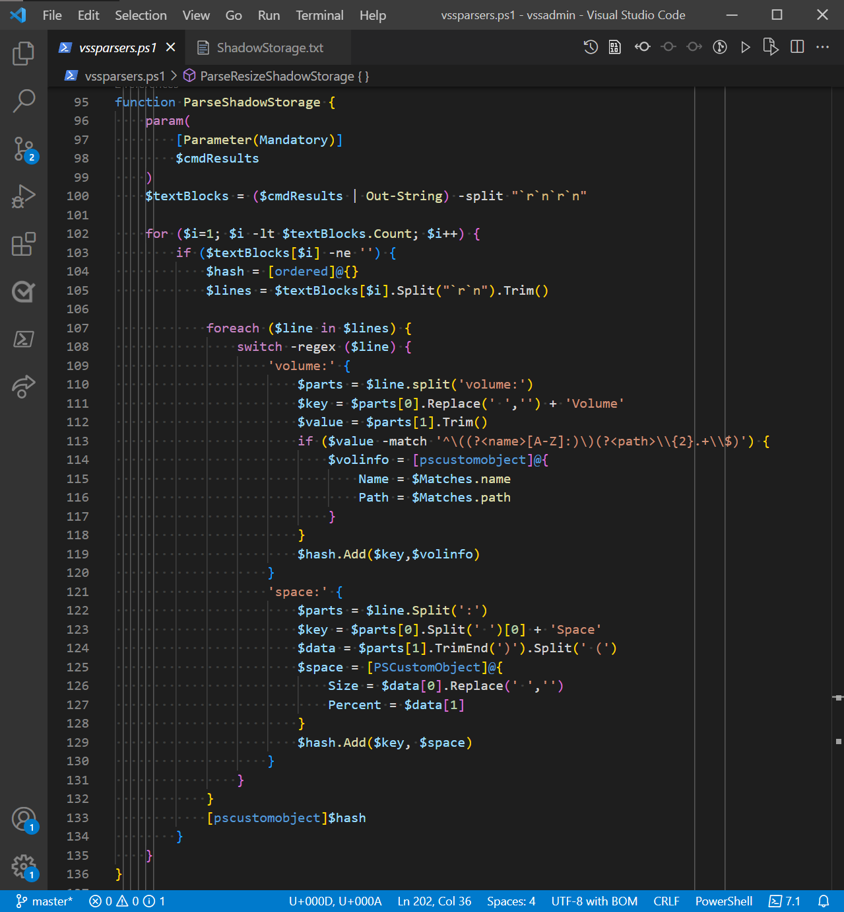
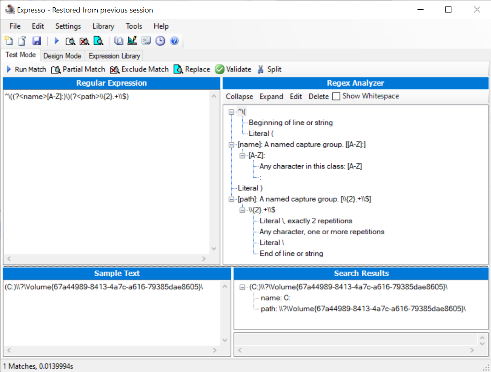

In my [previous post][2], I showed you how to parse the output from the `netstat` command. The
output of `netstat` is not very complex. The goal of the post was to introduce some parsing
strategies that you can use to create a full Crescendo module. In this post, I explain the details
of a more complex parsing function that I created for my [VssAdmin module][7].

## Examining the parser for `Get-VssShadowStorage`

The following screenshot shows the `ParseShadowStorage` function that is called by the
`Get-VssShadowStorage` cmdlet to handle the output from `vssadmin.exe`. The parsing process is
broken into four areas:

- Collect the native command output into a single text blob then split it into blocks of text (lines
  96-100)
- Parse each line of a text block (lines 105-132)
- Collect the parsed data in a hashtable (lines 104, 119, and 129)
- Return the collected data as an object (line 133)



### Collecting the native command output

The output from `vssadmin.exe list shadowstorage` is passed into the output handler function as an
array of strings. Here is an example of the output:

```
vssadmin 1.1 - Volume Shadow Copy Service administrative command-line tool
(C) Copyright 2001-2013 Microsoft Corp.

Shadow Copy Storage association
   For volume: (C:)\\\\?\\Volume{67a44989-8413-4a7c-a616-79385dae8605}\\
   Shadow Copy Storage volume: (C:)\\\\?\\Volume{67a44989-8413-4a7c-a616-79385dae8605}\\
   Used Shadow Copy Storage space: 22.1 GB (4%)
   Allocated Shadow Copy Storage space: 22.5 GB (4%)
   Maximum Shadow Copy Storage space: 23.7 GB (5%)
```

All the `vssadmin.exe` commands followed this pattern. There is a 2-line header followed by one or
more groups of lines of data. Each group of text is separated by a blank line. So first, I wanted to
get the text split into the blocks separated by the blank line.

Piping the `$cmdresults` parameter to `Out-String` turns that array of lines into one contiguous
blob of text. Then, I split that blob into blocks of text at the blank line using the
``-split "`r`n`r`n"`` operator. The `$textblocks` variable now contains 2 block of text. The first
block is the header and the second block is the data. Using the `for` loop on line 102 I start
proccessing the lines in the second text block. I can skip the first since is only contains the
header.

### Parsing the lines of the textblocks

On line 105, I split the text block into an array of lines so that I can process each line. Looking
at the example data above, I can see that there are two kinds of information: _volume_ and _space_
information.

Since both information sets have the same basic format, I only need one parser for each type of
information. Beginning on line 107, the `foreach` loop iterates over each line of the text block. On
line 108, the `switch` statement uses regular expression matching (regex) to determine whether the
line contains _volume_ or _space_ information. Lines 109-120 parse the volume information. Lines
121-130 parse the space information.

In both cases, I want to collect the data in a key/value pair. The line is split into two parts
by the **"volume:"** or **"space:"** strings.

The text of the first part is used to create the key name.

- For volume information, I remove the spaces from the text to form the key names: **ForVolume** and
  **ShadowCopyStorageVolume**.
- For space information, I split out the first word to form the key names: **UsedSpace**,
  **AllocatedSpace**, and **MaximumSpace**.

The second part contains the value data. Each information type contains two data values:

- For volume information: the volume name and path

  In line 113, I use a [regex with named groups](#expresso) to isolate the volume name and path from
  the string data. Those values are assigned to properties of the `$volinfo` object, which becomes
  the value for the key/value pair.

- For space information: the size and percent usage

  To get to the space data items, I split the string at the open parenthesis `(` and trim off the
  closing parenthesis. The first part becomes the size value and the second part becomes the
  percentage. Similar to the volume data, these values are assigned to properties of the `$space`
  object, which becomes the value of the key/value pair.

### Returning the object

I now have a key/value pair ready to be added to a hashtable in line 119 or 129. Once all the lines
have been parsed, the hashtable is complete. Line 133 converts the hashtable to a **PSObject**,
which is returned to the `Get-VssShadowStorage` cmdlet function for output.

## Conclusion

I use this same strategy to create parsing functions for all of the `vssadmin` command outputs.

- Collect the native command output as a single text blob
- Split the blob into separate text blocks
- Parse each line of a text block to extract the data
- Collecting the parsed data in a hashtable
- Return the collected data as an object

I used several different methods to parse the strings into data:

- String class methods (`Split()`, `Trim()`, `Replace()`)
- PowerShell Operators (`-split` and `-match`)
- Regular expressions (with `-match` and `switch`)

Each native command has its own unique output. Crescendo does not help you analyze or parse that
output. You must take the time to collect the output, analyze the structure of the information, and
devise a strategy for extracting the data from the strings.

Crescendo separates the structural code required to create a cmdlet from the functional code that
extracts the data. In my next post, I will take a close look at the JSON configuration file that
Crescendo uses to define the structural code.

## Resources

Posts in this series

- [My Crescendo journey][1]
  - [My VssAdmin module][7]
- [Converting string output to objects][2]
- A closer look at a Crescendo Output Handler - this post
- A closer look at a Crescendo configuration file - coming soon

References

- [about_Regular_Expressions][3]
- [about_Operators][4]
- [about_Switch][5]
- [Expresso by Ultrapico][6] - my favorite (and free) regular expression tool

  <a id='expresso'></a>

<!-- link reference -->
[1]: https://devblogs.microsoft.com/powershell-community/my-crescendo-journey/
[2]: https://devblogs.microsoft.com/powershell-community/converting-string-output-to-objects/
[3]: https://docs.microsoft.com/powershell/module/microsoft.powershell.core/about/about_regular_expressions
[4]: https://docs.microsoft.com/powershell/module/microsoft.powershell.core/about/about_operators
[5]: https://docs.microsoft.com/powershell/module/microsoft.powershell.core/about/about_switch
[6]: http://www.ultrapico.com/Expresso.htm
[7]: https://github.com/sdwheeler/tools-by-sean/tree/master/modules/vssadmin
