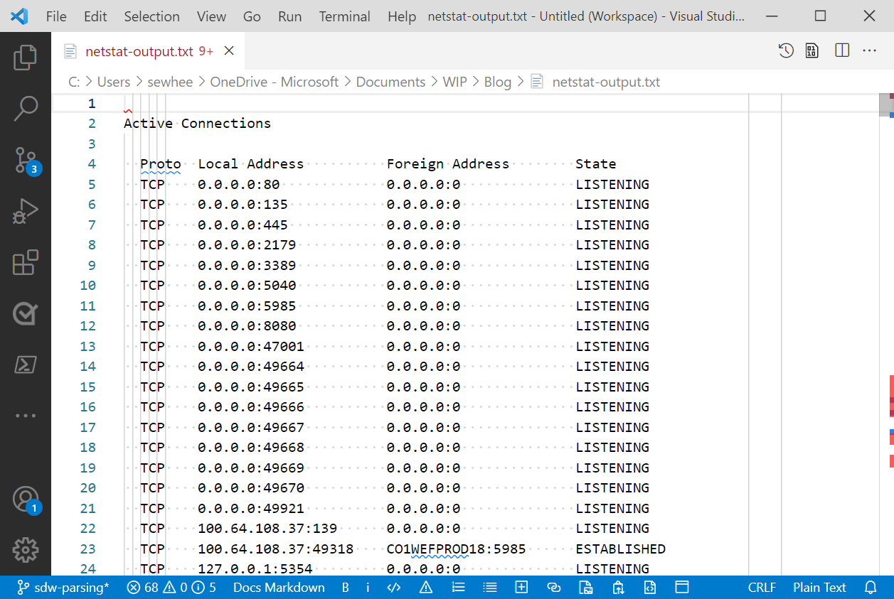

In my [previous post][1], I talked about using Crescendo to create a PowerShell module for the
`vssadmin.exe` command in Windows. As I explained, you have to write Output Handler code that parses
the output of the command you are using. But if you never written a parser like this, where do you
start?

In this post I show you how to parse the output from the `netstat` command. The output of `netstat`
is not very complex and it is basically the same on Windows and Linux systems. The goal here is to
talk about parsing strategies that you can use to create a full Crescendo module.

## Step 1 - Capture the output

To create a parser you have to capture the output so you can analyze it deeply enough to understand
the structure. Capturing the output is easy.

```powershell
netstat > netstat-output.txt
```

## Step 2 - Analyze the output

The goal of this analysis is to isolate the important data points. There are several question you
want to answer as you look at the captured output.

- What are the individual data points being displayed?
- How is the data labeled?
- What information needs to be parsed and what can be ignored?
- What repeating patterns exist in the output?
  - Look for delimiters and labels
- Does the data format change? What formats must be handled?



Here are my observations about the output from `netstat`.

1. There is only one set of header lines. The output is not divided in to multiple sections with
   different headers. The column headers contain spaces in the column names making parsing more
   difficult.
1. The output is presented as a table. The columns are labeled (Proto, Local Address, Foreign
   Address, State). Each row of the table is formatted the same with spaces separating the columns.
1. The **Address** columns contain a mix of IP Addresses and Host names, both with ports. The ports
   can be numeric or text.
1. The IP Addresses can be formatted as IPv4 or IPv6 addresses. The IPv6 addresses are enclosed in
   brackets (`[]`).
1. There are no space character inside the data columns but there are colon characters. This makes
   the space character a good delimiter, as opposed to the colon.

Now I can start writing code for the parser.

## Step 3 - Write the parser

From my analysis, I can tell that I am really only interested in rows of data. I don't care about
the table header because it never changes. So I can just ignore it. The first row of data starts
after the table header. There are two ways to get data passed to your parsing function:

- Streaming data on the pipeline

  If I am streaming data, my parser function must accept input from the pipeline and I must look for
  the header line then start parsing the data on the next line.

- Passing the entire output from the command as the value for a parameter

  If the data is passed in as a single object, then I can just skip to the first line of data to
  begin parsing. This is the method I am going to use in this example.

Getting the output of `netstat` into a variable is simple. You see that it returns an array of 440
lines of text. We know from our analysis that the table header is on the fourth line (third line for
Linux), so the data starts on the next line.

```powershell
PS> $lines = netstat -a
PS> $lines.count
440
PS> $lines[3]
  Proto  Local Address          Foreign Address        State
PS> $lines[4]
  TCP    0.0.0.0:80             0.0.0.0:0              LISTENING
```

To parse the rows into the individual columns of data we need to use the space character as a
delimiter to split the line. Since the number of spaces between columns is variable, the split
operation creates empty fields between the data. We can filter those empty fields out with a
`Where-Object`. For example:

```powershell
$columns = ($lines[4] -split ' ').Trim() | Where-Object {$_ }
$columns
TCP
0.0.0.0:80
0.0.0.0:0
LISTENING
```

In this example, the `Trim()` method trims off leading and trailing spaces. This ensures that the
fields between the columns become empty strings.

## Step 4 - Output the object

The only thing left to do now is to create a PowerShell object that contains the parsed data. Let's
put this all together.

```powershell
function parseNetstat {
    param([object[]]$Lines)

    if ($IsWindows) {
        $skip = 4
    } else {
        $skip = 3
    }

    $Lines | Select-Object -Skip $skip | ForEach-Object {
        $columns = ($_ -split ' ').Trim() | Where-Object {$_ }
        [pscustomobject]@{
            Protocol = $columns[0]
            LocalAddress = $columns[1]
            RemoteAddress = $columns[2]
            State = $columns[3]
        }
    }
}

parseNetstat (netstat) | Select-Object -Last 10
```

For this example, I limit the output to the last 10 rows.

```powershell-console
Protocol LocalAddress                                   RemoteAddress                 State
-------- ------------                                   -------------                 -----
TCP      [2600:6c56:7e00:78d:e1e8:756c:d2be:42da]:61001 [2603:1036:303:3000::2]:https TIME_WAIT
TCP      [2600:6c56:7e00:78d:e1e8:756c:d2be:42da]:61018 [2603:1030:408::401]:https    ESTABLISHED
TCP      [2600:6c56:7e00:78d:e1e8:756c:d2be:42da]:61293 [2603:1036:303:3000::2]:https ESTABLISHED
TCP      [2600:6c56:7e00:78d:e1e8:756c:d2be:42da]:62640 [2603:1036:303:3c33::2]:https ESTABLISHED
TCP      [2600:6c56:7e00:78d:e1e8:756c:d2be:42da]:62643 [2603:1036:303:3c04::2]:https ESTABLISHED
TCP      [2600:6c56:7e00:78d:e1e8:756c:d2be:42da]:62659 [2603:1036:303:3050::2]:https TIME_WAIT
TCP      [2600:6c56:7e00:78d:e1e8:756c:d2be:42da]:64886 ord37s36-in-x0d:https         ESTABLISHED
TCP      [2600:6c56:7e00:78d:e1e8:756c:d2be:42da]:64887 [2603:1036:404:8e::2]:https   TIME_WAIT
TCP      [2600:6c56:7e00:78d:e1e8:756c:d2be:42da]:64901 [2620:1ec:21::18]:https       ESTABLISHED
TCP      [2600:6c56:7e00:78d:e1e8:756c:d2be:42da]:65492 ord30s21-in-x0e:https         TIME_WAIT
```

Success! I now have converted text output to a PowerShell object. At this point, this is enough to
become an **Output Handler** for a Crescendo module.

If we want to get fancier, we can parse the address columns into the IP Address and the Port. That
data is in `$column[1]` and `$column[2]`. To separate the Port from the IP Address we have to
determine if the address is IPv4 or IPv6. The following code handles this:

```powershell
if ($columns[1].IndexOf('[') -lt 0) {
    $laddr = $columns[1].Split(':')[0]
    $lport = $columns[1].Split(':')[1]
} else {
    $laddr = $columns[1].Split(']:')[0].Trim('[')
    $lport = $columns[1].Split(']:')[1]
}
if ($columns[2].IndexOf('[') -lt 0) {
    $raddr = $columns[2].Split(':')[0]
    $rport = $columns[2].Split(':')[1]
} else {
    $raddr = $columns[2].Split(']:')[0].Trim('[')
    $rport = $columns[2].Split(']:')[1]
}
```

First I check that a column contains an open bracket character (`[`]). If it doesn't, I can split
the string at the colon character (`:`). If not then I need to split is at the string `']:'` and
also trim off the opening bracket.

After adding that code to the function I can now filter on the port information. For example:

```powershell
 parseNetstat (netstat) |
    Where-Object {$_.RemotePort -eq 'https' -and $_.State -eq 'ESTABLISHED'} |
    Select-Object LocalAddress, LocalPort, RemoteAddress, RemotePort -Last 10

LocalAddress                           LocalPort RemoteAddress         RemotePort
------------                           --------- -------------         ----------
2600:6c56:7e00:78d:e1e8:756c:d2be:42da 55643     2603:1036:303:3c1d::2 https
2600:6c56:7e00:78d:e1e8:756c:d2be:42da 59703     2620:1ec:21::18       https
2600:6c56:7e00:78d:e1e8:756c:d2be:42da 59708     2603:1036:303:3c1d::2 https
2600:6c56:7e00:78d:e1e8:756c:d2be:42da 60834     2620:1ec:42::132      https
2600:6c56:7e00:78d:e1e8:756c:d2be:42da 60835     2603:1036:303:3c1c::2 https
2600:6c56:7e00:78d:e1e8:756c:d2be:42da 61018     2603:1030:408::401    https
2600:6c56:7e00:78d:e1e8:756c:d2be:42da 61293     2603:1036:303:3000::2 https
2600:6c56:7e00:78d:e1e8:756c:d2be:42da 61399     ord30s21-in-x03       https
2600:6c56:7e00:78d:e1e8:756c:d2be:42da 65025     2603:1036:303:3c0a::2 https
2600:6c56:7e00:78d:e1e8:756c:d2be:42da 65053     2603:1036:303:3c0c::2 https
```

## Conclusion

Writing the output parser is the hardest part of wrapping a native command, whether you are using
Crescendo or not. In this post I have used a few simple techniques for extracting data from the
strings. In my next blog post I will take a closer look at a more complex parsing example that I
wrote for my VssAdmin module.

If you are interested in the final version of the script in this post, you can find it in this
GitHub [Gist][2].

<!-- link reference -->
[1]: https://devblogs.microsoft.com/powershell-community/my-crescendo-journey/
[2]: https://gist.github.com/sdwheeler/0ab90a646d401c2e0de36fac59b7cf65
