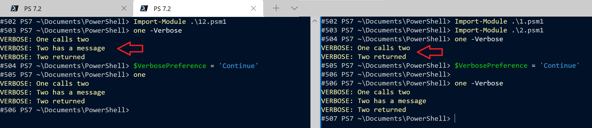
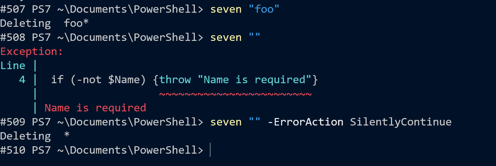

# Progress in PowerShell: a tale of Verbosity and other preferences with lessons in Scopes and Proxies thrown in

It started, as these things often do, with someone complaining. In PowerShell Version 7.2 the output of `Invoke-WebRequest -Verbose` and `Invoke-RestMethod -Verbose` look like this:

```powershell-console
VERBOSE: GET with 0-byte payload
```

In all the earlier versions they look like the version below , which is more helpful when you're trying to debug code that builds URIs:

```powershell-console
VERBOSE: GET https://google.com/ with 0-byte payload
```

A *proxy function* will fix that. If two commands have the same name an alias beats a function,
which beats a cmdlet, which beats an external program. You can specify the full path
to an external program or cmdlet - for example `Microsoft.PowerShell.Utility\Invoke-RestMethod`
so an `Invoke-RestMethod` *function* can act as a *proxy* for the cmdlet, anything which calls `Invoke-RestMethod` will go to the function, which calls the cmdlet with its fully qualified name. PowerShell even has a mechanism to create the function's code:

```powershell
$cmd      = Get-Command Invoke-RestMethod
$MetaData = New-Object System.Management.Automation.CommandMetaData $cmd
[System.Management.Automation.ProxyCommand]::create($MetaData) | clip
```

(I don't carry those 3 lines in my head, when I need them I refer to a script Jeffrey Snover wrote long ago, a newer version is [on the PowerShell Gallery](https://www.powershellgallery.com/packages/MetaProgramming/1.0.0.2) .)  
I added extra `Write-Verbose` calls and tidied up the autogenerated code and posted the result  [as a gist](https://gist.github.com/jhoneill/f8ddd4e4e0a25c22d77749166d6f14fe).  
A module I'm working has lots of calls to `Invoke-RestMethod`
but the proxy function wouldn't see that I'd specified `-Verbose`. So I needed to investigate.

The `-Verbose` switch sets the value of `$VerbosePreference` in the function being called;
if you thought setting the global `$VerbosePreference` to `continue` was the same as a running
everything with `-Verbose`, trying the following might surprise you:

```powershell
$VerbosePreference="Continue"
Invoke-WebRequest "https://google.com" -OutFile delete.me
Copy-Item delete.me delete.too
```

`Invoke-WebRequest` heeds the preference, but `Copy-Item` only prints a message if the `-Verbose` *switch* is specified.

My proxy function would print a verbose message if run with `-Verbose`, it *would* heed the global preference-variable but not the switch passed to the function that called it.
The `-Confirm`, `-Debug`, `-ErrorAction`, `-InformationAction`, `-Verbose`, `-WarningAction`, and `-WhatIf` switches *all*
set the corresponding preference-variable inside a function but that wasn't being inherited when the functions in my module called the proxy function.  
I could reproduce this with the two functions below. First, I loaded them from a
single .PSM1 file (and things were the same if I pasted them in at a PowerShell prompt)

```powershell
function one {
  [cmdletBinding()]
  param()
  Write-Verbose "One calls two"
  two
  Write-Verbose "Two returned"
}

function two {
  [cmdletBinding()]
  param()
  Write-Verbose "Two has a message"
}
```

If I load this, I get three messages:

```powershell-console
VERBOSE: One calls two
VERBOSE: Two has a message
VERBOSE: Two returned
```

Things change if `One` is in it’s own module



`One -verbose` now just produces two messages:

```powershell-console
VERBOSE: One calls two
VERBOSE: two returned
```

Setting the global preference-variable at the prompt returns all 3 - because function `two` sees it.  
It is common to assume that *a function inherits the variables from whatever called it*; we can see that working with simpler functions

```powershell
function three {
    $e="ewe"
    four
}

function four {
    $e
} 
```

If I set “e” and run `three` from the prompt

```powershell-console
> $e = "eye"  
> three
ewe
```

the assumption holds; and a lot of documentation stops there, but if I import `three` from a module

```powershell-console
> three
eye
```

The inheritance assumption is qualified by a rule that says *what happens in a module stays in the module*.  
The question is *what can we do about it ?*

Before it dawned this was a *scopes* thing and not just `-Verbose`, a search brought me [a clue](https://deangrant.me/2015/10/03/inheriting-verbose-preference-in-windows-powershell-module-functions/); the solution is to change function `two` (or my proxy function) as follows:

```powershell
function two {
  [cmdletBinding()]
  param($VerbosePreference = $PSCmdlet.GetVariableValue('VerbosePreference')
  Write-Verbose "Two has a message"
}
```

We can only use `$PSCmdlet` if we have either `[cmdletBinding()]` or a `[parameter()]` decoration - just a side note on that, if you paste in

```powershell
function five { param ($p) }
function six  { param ([parameter()]$p) }
```

when you try to tab-complete parameters for `five` and `six`, you’ll see `six` gets all
the common parameters but `five` does not - `[parameter()]` is an implicit `[cmdletBinding()]`, although it's still good to write the latter explicitly.

`$PSCmdlet` is available *when the function is setting up its variables*. Inside the function we'd never replace `$x` with the long-winded
`$PSCmdlet.GetVariableValue("x")`, but *in a parameter* it is “use the value from the scope that called you - even if that scope *is* a module”.

*Now* the called function inherits the preference from its caller. If we specify `-Verbose` it takes precedence, so nothing breaks copying in `$VerbosePreference`. The same thing applies to `-Confirm` and `-WhatIf`.

```powershell
function seven {
  [cmdletBinding(SupportsShouldProcess=$true)]
  param()
  eight
  Write-Host "Something Safe "
}

function eight {
  [cmdletBinding(SupportsShouldProcess=$true)]
  param()
  if ($PSCmdlet.ShouldProcess("This","Do you want to do")) {
    Write-Host "Something dangerous"
  }
}
```

If `seven` and `eight` are loaded from the same psm1 file  

```powershell-console
seven -Confirm

Confirm
Are you sure you want to perform this action?
Performing the operation "Do you want to do" on target "This".
[Y] Yes [A] Yes to All [N] No [L] No to All [S] Suspend [?] Help (default is"Y"): n

Something Safe
```

But, if `seven` loads from its own module …

```powershell-console
seven -Confirm
Something dangerous
Something Safe
```

Modifying the parameters in `eight` with the code below restores the confirmation

```powershell
param($ConfirmPreference = $PSCmdlet.GetVariableValue('ConfirmPreference'))
```

`-confirm` sets `$confirmPreference` to `low` which triggers `$PSCmdlet.ShouldProcess` to prompt the user. I treat `-Force` as an extra preference and my functions typically have  
`if ($Force -or $PSCmdlet.ShouldProcess(...`  
to ensure the a command can be run non-interactively, even if its impact is set higher than `$ConfirmPreference`.

The example above might lead you to think `-Confirm` and `-WhatIf` *should* be inherited, but this would cause a problem with scopes at the `script` level (which apply module-wide). Suppose the module that contained seven read like this:

```powershell
$ConfirmPreference = 'None'

function seven {
...
}
```

Any cmdlet that would normally ask for confirmation inside `seven` will run silently. But what if the module containing `eight` sets that option to something different? If a function overrides something from its own script-scope, then only things which share that scope see the change, which seems logical. Thinking of functions' scopes as *children* of their module's scope which in turn is usually a child of the global scope means we can say things pass down their branch of the scope “tree” but don't jump *between* branches.

Before leaving `$ConfirmPreference`, I have been think about changing it inside a function, so it drops to `low` if
many items are being updated. I’m not sure that's a great idea because coming to *rely* on a
prompt and which isn't there *reliably*, will lead to trouble.

The title said this is about *Progress*. PowerShell 7.2 has an optional new way of
displaying the progress bar, but the things it relies on are a bit flaky in the
Integrated-Shell in Visual Studio Code
(things improve if you use `Write-Progress -completed`) and `Invoke-WebRequest` downloading 100 log files becomes a mess.
There is no `-Progress` common parameter, but the day before I started on the `-Verbose` problem, I had found that adding
`$ProgressPreference` as a parameter worked, so it makes sense to do it the same way. I inserted the following parameter into the function that calls `Invoke-WebRequest`. Unlike the examples above, which might be tagged with `[Parameter(DontShow)]` I want this to tab-complete the possible values, so it is marked with the `ActionPreference` type:

```powershell
[ActionPreference]$ProgressPreference = $PSCmdlet.GetVariableValue('ProgressPreference')
```

And I will also want *that* to inherit into my proxy function.  
With that in place, I can use the code below to call my function and replace the byte-by-byte progress indicator that `Invoke-WebRequest` displays with my own file-by-file one:

```powershell
$count = 0
ForEach ($f in $file) {
  Write-Progress "Downloading" -PercentComplete ($count/$file.Count)
  Myfunction $f -ProgressPreference SilentlyContinue
  $count += 100
}
Write-Progress "Downloading" -Completed
```

Quick tip: adding 100 to the counter each time (instead of adding 1) removes the need to multiply by 100 for a percentage.

Since I mentioned `ErrorAction` above, before finishing I wanted to share one last tip about preferences:

```powershell
function nine {
  [cmdletBinding()]
  param ($Name)
  if (-not $Name) {throw "Name is required"}
  Write-Host "Deleting $Name*"
}
```

The “dangerous” line in the example above never runs if `$n` is empty, right? Wrong, actually.



Specifying `-ErrorAction` prevents the `throw` statement throwing so

`nine "" -ErrorAction SilentlyContinue` would mean the dangerous code *is* run.

When it is acting as a “fence” around dangerous code, it is worth putting a `return` after `throw`.
