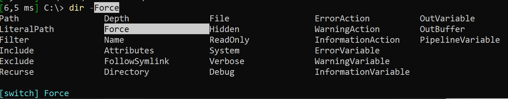
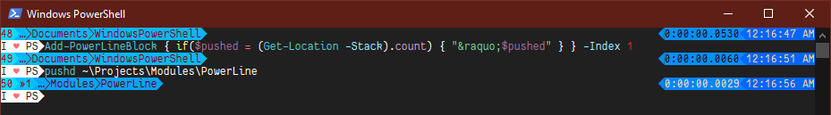
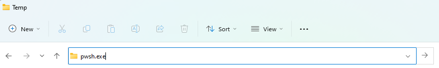
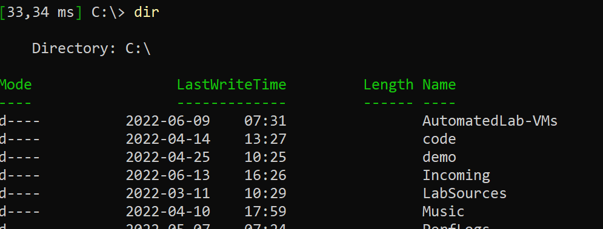
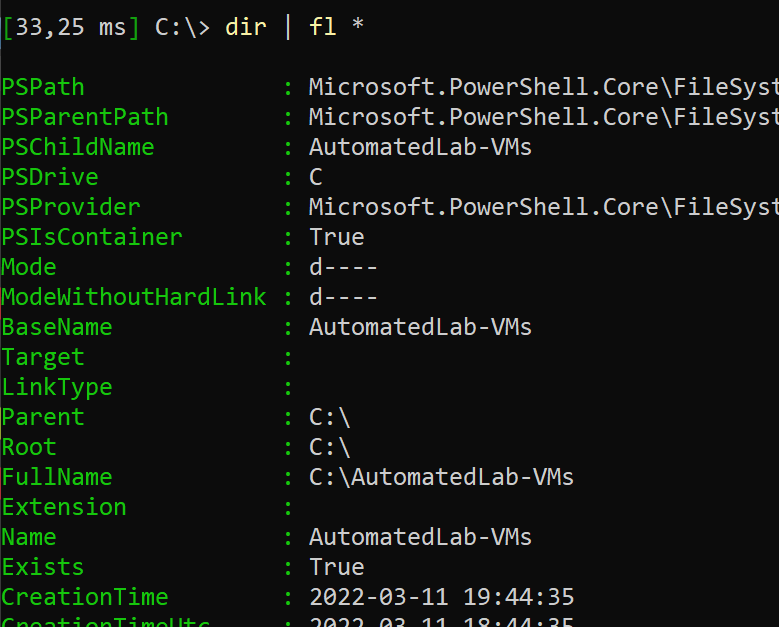

PowerShell can take some getting used to.
Especially if you come at it from a different Shell and don't see any way to get your good old experience back.
However, hidden behind that plain white on blue shell, there is actually a wide range of customization options that help make your life less painful.
See below for the most commonly appreciated options.

## Tab Completion

The classic complaint we hear is that in Windows, Tab Completion is so much less helpful than for example in Bash.
This is mostly because <kdb>CTRL</kdb>+<kdb>Space</kdb> is hard to discover, unless somebody shows you.
Same menu choice as in Bash, but you can pick your preferred option using the arrow keys and each option may come with some documentation:



> Use whenever you would use the Tab Key

## Key Bindings

There are a few keybindings that come in handy to know:

|Keybinding|Function|
|---|---|
|<kdb>Ctrl</kdb>+<kdb>Space</kdb>|Tab Menu|
|<kdb>Ctrl</kdb>+<kdb>r</kdb>|Search in your input history|
|<kdb>Ctrl</kdb>+<kdb>a</kdb>|Select everything in your current input/command line|
|<kdb>Ctrl</kdb>+<kdb>c</kdb>|Copy everything currently selected in your input/command line to your clipboard|
|<kdb>Ctrl</kdb>+<kdb>v</kdb>|Paste your clipboard into the current input/command line|
|<kdb>Shift</kdb>+<kdb>Enter</kdb>|Type multiline text in your console without executing the command|

Specifically, it is important to get used to not pasting with right-click - by using <kdb>Ctrl</kdb>+<kdb>v</kdb> instead, you get a single input history for multiple lines, you can preview your input before sending it (helps with those artifacts you get when pasting from Teams) and you stop accidentally overwriting your clipboard by selecting something in the console window.

Also, with right-click, you sometimes get the wrong order.

Oh, and you can [define your own keybindings](https://github.com/PowerShell/PSReadLine/blob/master/PSReadLine/SamplePSReadLineProfile.ps1) if you want to.
No need to accept the defaults.

## Packages

There are plenty of PowerShell packages out there that can make console life a lot less painful.
Use `Find-Module` to search for them and `Install-Module` to install them. Example:

```powershell
Find-Module *SQL*
Install-Module Powerline
```

Looking for a command but don't know the module it is from?

```powershell
Find-Module -Command Write-PSFMessage
```

## Profile / Start Script

The key to ultimate customization is to have a way to define code that runs on each console start without requiring manual action.
Now if only there were a way to do that in PowerShell ...

```powershell
$profile
```

Yeah, that simple. As long as that file exists, it will be run.

```powershell
notepad $profile
```

Add code, save, and you are good to go.

> There are different profile files per application running PowerShell - VSCode has a different one than pwsh.exe than powershell.exe.
> Make sure you edit the file you meant to edit.
> Or update the global profile for all applications: `$profile.CurrentUserAllHosts`

## PowerShell 7 / PowerShell Core

There's Windows PowerShell, which comes installed by default on any Windows.
But there's also a [cool version you have to first install](https://aka.ms/powershell-release?tag=stable).
It adds great convenience, better performance and the ability to actually like using Visual Studio Code with PowerShell.
You can grab it via a wide variety of sources, such as the Microsoft Store, Github or your preferred package manager.

You can also install it on MacOS or Linux.

You should do so, it's awesome.

## Prompt

Want to customize your prompt to be more colorful / fancy / whatever else you want it to do?

Well, all you need to do is override the function named `prompt` and put it in your profile and that's that.
Don't know how or want to borrow from others to make your life easier?

Give [Powerline (for PowerShell)](https://github.com/Jaykul/PowerLine) a chance.
They have some [fancy examples](https://github.com/Jaykul/PowerLine/tree/master/Source/Examples) as well!



## Dynamic Tab Completion

With the previous notes on Tab Completion, you already saw how to get better tab completion.
But PowerShell is still not reading your mind when it comes to the values provided - if a command doesn't offer it, you're out of luck.
Right?

Well no, there's tools to fix that.
There are some options, but the simple-most is probably from the [PSFramework project](https://psframework.org/documentation/documents/psframework/tab-completion.html).
To install it, run this line (once):

```powershell
Install-Module PSFramework
```

Then you can add the magic to your profile.
Here is a quick example on how to add values to the "-Tenant" parameter on "Set-AzContext":

```powershell
Register-PSFTeppScriptblock -Name AZ.Tenant -ScriptBlock {
  (Get-AZTenant).DefaultDomain
}
Register-PSFTeppArgumentCompleter -Command Set-AZContext -Parameter Tenant -Name AZ.Tenant
```

## The Clipboard

The clipboard is always a handy tool to interactively cross over between applications.
Now if only there were commands in PowerShell to do so ...

```powershell
Get-Clipboard
Set-Clipboard
```

And since we're all about being lazy, there's aliases for that: "gcb" and "scb".
On that note, if you want to paste multiple columns into Excel, you want to use the tab delimiter.
Don't do manual labor though, here's the easy way to get data ready to paste to Excel:

```powershell
dir | ConvertTo-Csv -Delimiter "`t" | scb
```

That `ConvertTo-Csv` is way too much text though. Wouldn't it be nice to make that shorter?

## Aliases

In PowerShell, there is an easy way to be lazy: Aliases.
Use their power to abbreviate your commonly used commands.
Then put it in your `$profile` so you don't have to remember to add them.

```powershell
Set-Alias ctc ConvertTo-Csv
```

And now that previous line can be shortened to:

```powershell
dir | ctc -d "`t" | scb
```

Where is that "-d" coming from though?

## Short Parameter Names

You know all these commandline tools that have a long and a short notation for their parameters?
Like where you can either specify "--help" or "-h"?

Well, PowerShell takes that a step further:
You only need to type enough of the parameter name to uniquely identify it.

Using the example above with `ConvertTo-Csv`, there is only a single parameter that starts with "D", so that's enough to specify it.

> Actually, there is a common parameter named "Debug", but those don't count here.

## More Tools to improve the Console Experience

A lot more tools have been created to help being lazy & comfortable than could possibly all be listed, but here a few more projects out there that can help make console life more comfortable:

|Tool|Description|
|---|---|
|[AZ.Tools.Predictor](https://docs.microsoft.com/powershell/azure/az-predictor)|Predictive intellisense for the AZ modules|
|[TabExpansionPlusPlus](https://www.powershellgallery.com/packages/TabExpansionPlusPlus/1.2)|Adds tab completion for classic commandline tools such as ROBOCOPY|
|[PSUtil](https://www.powershellgallery.com/packages/PSUtil)|Adds keybindings, aliases and other conveniences|
|[oh-my-posh](https://ohmyposh.dev/)|Transform your prompt, alternative to the Powerline module shown above|
|[posh-git](https://github.com/dahlbyk/posh-git)|Add git integration to your prompt|

## Paths, Explorer & PowerShell

Often enough you want to interact with the file system across applications:

+ Got the explorer open and want to start PowerShell in that path?
+ Just created an output file and want to open it?
+ Open the explorer in the current path?

For all of that there are convenient options.
From within the shell, `Invoke-Item` or its alias `ii` allow you to open a path in its default application:

```powershell
ii .\report.csv # Probably Excel
ii . # Current path in Explorer
```

The other way around works just as convenient.
In the Windows Explorer, just type `pwsh.exe` (or `powershell.exe`, if you didn't upgrade):



## Inspecting Output

When you run a command, often enough you get some nice table, that is easy to read, but kind of lacking in data:



Fortunately, by piping to `FL *`, you get to see everything (even if it is a bit much):



## Concluding

> "I designed PowerShell to optimize the user, not the code"
>
> -Jeffrey Snover, inventor of the PowerShell

PowerShell allows us to optimize the way we work in the console, it is designed to help us automate and make problems go away.
So why do I see so many people who don't apply that same perspective to their own, personal console environment?
Go ahead and settle in in your console ... or face the charge of being insufficiently lazy!

:)
