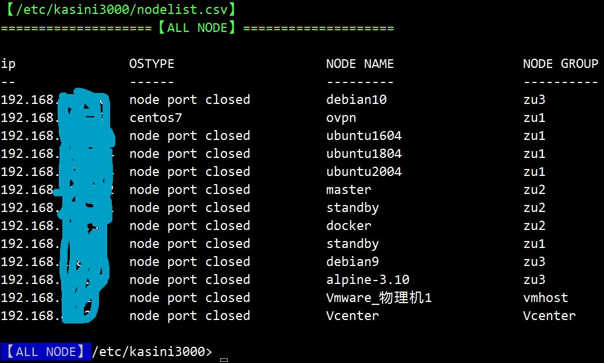


---

post_title: PowerShell Automation:Introduction To Kasini3000
username: chuanjiao10
categories: PowerShell
tags: Ansible , pipeline , winrm , SSH , psremoting , automation , devops
summary: devops automation operation and maintenance tool for script.Similar to Puppet, SaltStack, Ansible, pipeline.

---

main site: https://gitee.com/chuanjiao10/kasini3000

site mirror: https://github.com/kasini3000/kasini3000 --- Welcome give star to project

win,linux devops automation batch script framework.(It is similar to Puppet，Ansible，pipeline)
Open source, free, cross-platform


### English manual:

https://gitee.com/chuanjiao10/kasini3000/blob/master/docs/kasini3000_manual.xlsx


### kasini3000_agent_linux:

https://gitee.com/chuanjiao10/kasini3000_agent_linux

Shell script,one click install powershell on linux,modify sshd_config for PsRemote.


### feedback:

Submitting an issue with a github account is the easiest way to give feedback I think.

It would be better if you could join Tencent QQ group, which is an instant messaging software similar to msn.



---

## Difference between kasini3000 and ANSIBLE:

kasini3000 is script, ansible is YAML.
kasini3000 can transfer powershell objects between local and remote machines each other.

transfer powershell objects support ：win<->win,linux<->linux,win<->linux,linux<->win

Note: powershell commands in azure, aws, vmware, win node machines, will generate objects and return to the master machine.
for linux node , you need to construct the object yourself, here is an example:

c:\ProgramData\kasini3000\node_script

---

The technology, protocol, or feature keyword supported by "kasini3000":
Offline installation of win, linux, master, node and all libraries.
winrm, ssh, rsync between win and linux, batch telnet, batch sftp, batch ftp-sync, batch sftp-sync, sqlite, remote object transfer,
batch database client, picture alarm, balloon alarm, sound alarm, WeChat alarm , Dingding alarm.
Support from win, linux master sodo login to linux node.
Free support for 1 batch of linux2winrm. Another batch of linux2winrm is supported for a fee.
The remote command line from the master to node supports only bash in the Linux node, but no pwsh is installed. But this is not recommended.


Q: I already have my .py, .sh, .pl, .bat scripts, why use your framework?
A: The framework provides these functions:
Kasini3000 provides multi-process and multi-thread engine; automatic remote transfer of ps1 scripts and code blocks;
timed task engine; remote value transfer of objects; Batch modify win node, linux node password.


---

## win install：

```powershell
Remove-Item -LiteralPath 'c:\ProgramData\kasini3000' -Recurse -Force -Confirm:$false
cd 'c:\ProgramData\'
git clone https://gitee.com/chuanjiao10/kasini3000.git
#git clone git@gitee.com:chuanjiao10/kasini3000.git
c:\ProgramData\kasini3000\zkj_install_k记饭店_win主控机.ps1
#script dependencies 【c:\Users\【your_name】\Documents\kasini3000\nodelist.csv】
```

## linux install：

```powershell
Remove-Item -Force -LiteralPath '/etc/kasini3000'
cd /etc
git clone https://gitee.com/chuanjiao10/kasini3000.git
#git clone git@gitee.com:chuanjiao10/kasini3000.git
/etc/kasini3000/zkj_install_k记饭店_linux主控机.ps1
```

---

## customize nodelist.csv :

win file patch :          c:\users\【your_name】\Documents\kasini3000\user_config.ps1
inux file patch :         /root/kasini3000/user_config.ps1

```powershell
$global:被控机列表文件 = "${global:kasini3000_data_path}/nodelist111.csv"
$global:zd只读nodelist文件 = $false
$global:config = $false
$global:0k_source = $false
```

---

## nodelist.csv definition:

win file patch :          c:\users\【your_name】\Documents\kasini3000\nodelist.csv

inux file patch :         /root/kasini3000/nodelist.csv

ip,port,user,pass for win
ip,port,user for linux.
If the linux password field is not empty string, the linux password can be used to push ssh-pub-key-file
./cduuid 'c3afb273-8ab4-4ec2-8716-12a05fac1bfe'
./cdname 'the name of node'
./cdip 'the ip of node'
./cdg 'the group of node'
The password timestamp is used for batch password change script for win
node os type is an empty field. When connected to the node, its value is written into the powershell varible

You can add any custom fields to nodelist.csv. For example: region

---

## make two ssh-keyfile for linux node :

Change one of two key in turn every 3-6 months.

run:
/etc/kasini3000/gx更新主控机ssh秘钥1.ps1
/etc/kasini3000/gx更新主控机ssh秘钥2z.ps1

created file path win:
c:\users\【your_name】\Documents\kasini3000\ssh_key_files_old1\id_rsa
c:\users\【your_name】\.ssh\id_rsa
c:\users\【your_name】\Documents\kasini3000\ssh_key_files_old1\authorized_keys

created file path linux:
/root/.ssh/id_rsa
/root/kasini3000/ssh_key_files_old1/id_rsa
/root/kasini3000/ssh_key_files_old1/authorized_keys


on win master,push c:\users\【your_name】\Documents\kasini3000\ssh_key_files_old1\authorized_keys to linux node /root/.ssh/authorized_keys:

```powershell
winscp复制主控机公钥到被控机_win2linux_pwd.ps1 -ipaddress nodeip -root_password 'xxx'
winscp复制主控机公钥到被控机_win2linux_pwd.ps1 -ipaddress nodeip -sudo_user 'aaa' -sudo_password 'bbb'
or
putty复制主控机公钥到被控机_win2linux_pwd.ps1 -ipaddress nodeip -root_password 'xxx'
putty复制主控机公钥到被控机_win2linux_pwd.ps1 -ipaddress nodeip -sudo_user 'aaa' -sudo_password 'bbb'
```

on linux master,push /root/kasini3000/ssh_key_files_old1/authorized_keys to linux node /root/.ssh/authorized_keys:
use ssh-copy-id


### Set Language to english：
set_Language_english.ps1

Welcome to help translate the project to English.

setting file:
config.ps1


---

## console:

k-console.ps1 #console main program,
krun.ps1 #run kasini3000 script or file
k_run_ip.ps1 #run kasini3000 script or file

goto node console,"exit" to exit ,like powershell Enter-PSSession
./gtnode

verbose on
./v-kai开启详细信息输出.ps1


choose node:
./cdall choose all node
./cduuid 'c3afb273-8ab4-4ec2-8716-12a05fac1bfe'
./cdname 'the name of node'
./cdip 'the ip of node'
./cdg 'choose a group of node'
./cdos 'win7' choose all win7
'win7','win8','win10','win11','win2008r2','win2012r2','win2016','win2019','win2022','centos6','centos7','centos8','debian9','debian10','ubuntu1404','ubuntu1604','ubuntu1804','ubuntu2004','Amazon Linux 2','kylin v10','alpine','统信UOS服务器版'

./cdwin #choose all win
./cddebian #choose all debian 9,debian10,debian11
./cdubuntu #choose all ubuntu 1604---2204


---

### 1 Remote command line：

(from win,linux master,to win,linux node)

```powershell
$object_return_from_node_to_master = ./k_run_ip -ip 1.1.1.1 -scriptblock {command_on_node} -allparameter $a,$b
$object_return_from_node_to_master = ./k_run_ip -ip 1.1.1.1 -file 'd:\script_file_on_master.ps1' -allparameter $a,$b
$string_return_from_node_to_master = ./k_run_ip -ip 1.1.1.1 -scriptblock { bash /tmp/xxx.sh} -allparameter $a,$b
```

### 2 Multi-process batch execution:

default timeout:30min max:10day max-process:99,change from create user_config.ps1

```powershell
k-commit.ps1 -ip 1.1.1.1 -scriptblock {command_on_node} -allparameter $a,$b
k-commit.ps1 -ip 1.1.1.1 -file 'd:\script_file_on_master.ps1' -allparameter $a,$b
./kt.ps1 #table
./kl.ps1 #list
```

### 3 Multi-thread batch execution:

default timeout:10min max:1hour max-threaded:50per process,300 max limit.change from create user_config.ps1 #need powershell module poshrsjob
There is no need to run the command k-console.ps1 before k-commit-rs.ps1 command runs

```powershell
k-commit-rs.ps1 -ip 1.1.1.1 -scriptblock {command_on_node} -allparameter $a,$b
k-commit-rs.ps1 -ip 1.1.1.1 -file 'd:\script_file_on_master.ps1' -allparameter $a,$b
```
k_commit_ip_rs.ps1 # for advanced users


### get Multit-hreading or multi-Progress return from sqlite database on master.

./kt-rs.ps1 #table
./kl-rs.ps1 #list
./kt-rs -ip '192.168.168.223' #select ip from sqlite
./kt-rs -remark 'xxx'
./kt-rs -begin_time '2021-11-18 15:05:01'
./kt-rs -end_time '2021-11-18 16:05:01'
./kt-rs -grep 'disk full'

$global:_mtout  #kt-rs and kl-rs output variable

$global:_mpout  #kt and kl output variable

```powershell
foreach ($i in $global:_mtout)
{
　　if ($i['标准输出'].contains('xxx'))
　　{
　　　　'has xxx error'
　　}
}
```

**"-rs" on end of command is mean: "runspace" , is Multit-hreading.**
**kt,kl is: multi-Progress**


### 4 From win, linux master computer ,to win linux node computer, copy files. It helps you push your scripts to nodes.

k_copyfrom_ip.ps1 -ip 1.1.1.1 -Path 'node' -Destination 'master' #win2linux,win2win,linux2linux
k_copyto_ip.ps1 -ip 1.1.1.1 -Path 'master' -Destination 'node'


### 5 Execute your script by psremoting.

100% Compatible with all scripts(.py .sh .perl or more) in win and linux.
The results are stored in the sqlite database. According to node-ip, time, query results.

```powershell
./k_run_ip -ip 1.1.1.1 -scriptblock {
	/path/xxx.sh
}
# or
k-commit-rs.ps1 -ip 1.1.1.1 -scriptblock {
	python /path/xxx.py
}
```

### 6 ftp, sftp folder synchronization (win master only)

k_sync_ftpd2l_win.ps1
k_sync_l2ftpd_win.ps1
k_sync_l2sftpd_win.ps1
k_sync_sftpd2l_win.ps1
k_download_from_ftpd_win.ps1
k_upload2ftpd_win.ps1


### 7 The cwrsync client is encapsulated for rsync between win and linux.(win master only)

k_rsync_winfromlinux.ps1
k_rsync_wintolinux.ps1


### 8 txt2 voice reading alarm (win master only),

baoj中英文声音报警.ps1
\admin_gui\qwin右下角气球报警.ps1

win terminal background picture alarm:
c:\ProgramData\kasini3000\admin_gui\pic

Desktop wallpaper (script crossword) alarm:
only for QQ group users.


### 9 compress script:

c:\ProgramData\kasini3000\node_script\7z
l7za2zip.ps1
l7za27z.ps1
l7zu2zip.ps1
l7zu27z.ps1
l7zx.ps1


w7za2zip.ps1
w7za27z.ps1
w7zu2zip.ps1
w7zu27z.ps1
w7zx.ps1


### 10 node mem,cpu,disk info:

“c:\ProgramData\kasini3000\node_script”  on master <----> on node “c:\ProgramData\kasini3000\node_script”

to copy node_script folder to node:

```powershell
./cdip 1.2.3.4
./kctf复制主控机node_script目录脚本到当前被控机.ps1
```


### 11 find&replace tool,like linux SED:

c:\ProgramData\kasini3000\node_script\kasini3000\psed.ps1
manual: c:\ProgramData\kasini3000\docs\ps找算替_v3_readme.html


### 12 Batch password change:
12.1 Build an 18-bit random number and write it into the old password field in nodelist. csv

c:\ProgramData\kasini3000\cs产生所有被控机旧密码并写入nodelist.ps1


12.2 Change the password, verify, swap the current password and old password fields, and write the password change time.

c:\ProgramData\kasini3000\zkj_s所有linux被控机改密码_验证周期_改密码_验证_对调密码_写入时间戳.ps1  # for all linux node on this nodelist.csv
c:\ProgramData\kasini3000\zkj_s所有win被控机改密码_验证周期_改密码_验证_对调密码_写入时间戳.ps1 # for all win node on this nodelist.csv


### 13 Install/remove packages, ignoring linux distribution installation command differences:

c:\ProgramData\kasini3000\node_script\bkj_remove_linuxpackage.ps1

c:\ProgramData\kasini3000\node_script\bkj_install_linuxpackage.ps1

use title 10 command ,copy up 2 files to each linux node,then:

```powershell
./k_run_ip -ip 1.2.3.4 { /etc/kasini3000/node_script/bkj_install_linuxpackage.ps1 -package_names 'a','b','no_this_packagename' }
```


### from linux client ,login to windwos server ,then send command and run:

1 install omi https://github.com/microsoft/omi
or https://github.com/jborean93/omi


After install microsoft OMI or jborean93/omi , then you can connect from linux to windows by WINRM-5985 (ntlm).
but OMI has some bug ,sctipt file name on windows does not support characters other than English.

2

```powershell
k_run_ip_port_l2w_user_pwd.ps1 -ip your_windows_node_ip -port xxx -user xxx -pwd xxx {
command on windows
more command ...
}
```

Here is a paid plugin for $20.
Support batch from linux to win (k-commit&k-commit-rs), support nodelist.csv


---


https://gitee.com/chuanjiao10/kasini3000/blob/master/k_run_ip_port_w2l_user_expect_pwd.ps1
The script solves the following problems:
1 The ps session from win to linux does not support the problem of specifying a password to login through parameter values.
2 The ps session from win to linux does not support specifying the sudo password through parameter values, and it is necessary to manually enter the sudo password.
3 Support the original parameter transfer of pssession. pass value.
4 For a single node machine, it cannot run concurrently. Powershell v5.x is not supported

5 need powershell install on linux

usage:

```powershell
$a = 123
[scriptblock]$b = { touch $args[0] }
c:\ProgramData\kasini3000\k_run_ip_port_w2l_user_expect_pwd.ps1 -sudo `
-ipaddress '192.168.1.2' -user 'xxx' -pwd 'xxx' `
-file 'd:\c.ps1' or -scriptblock $b
-allparameter $a
```

---

### Scheduled tasks on master:

c:\ProgramData\kasini3000\cmdb\u库_触发器表_添加触发器341.ps1 #add trigger
c:\ProgramData\kasini3000\cmdb\u库_计划表_添加动作331.ps1 #add action
c:\ProgramData\kasini3000\cmdb\u库_绑定_动作和触发器351.ps1 #Bind Trigger Action
ul.ps1
ut.ps1


---

### Standalone  script:does not depend on nodelist. csv, but relies on powershell on node
k_copyfrom_ip_port_l2l_user.ps1
k_copyfrom_ip_port_w2l_user.ps1
k_copyfrom_ip_port_w2w_user_pwd.ps1

k_copyto_ip_port_l2l_user.ps1
k_copyto_ip_port_w2l_user.ps1
k_copyto_ip_port_w2w_user_pwd.ps1

k_run_ip_port_l2l_user.ps1
k_run_ip_port_w2l_user.ps1
k_run_ip_port_w2w_user_pwd.ps1


### Standalone script: does not depend on nodelist. csv, does not depend on the powershell of the node computer, but depends on the winscp module on the master computer, which makes these scripts only available in win.
k_copyfrom_ip_port_winscp2bash_user_pwd.ps1
k_copyto_ip_port_winscp2bash_user_pwd.ps1
k_run_ip_port_winscp2bash_user_pwd.ps1 #only run one-line command

---

## devops

jenkins ---> pipeline(or script plugin) ---> powershell or pwsh on win/linux --->kasini3000

powershell gitlab client ---> shellhook ---> kasini3000

---
## final
"kaiiit's Hotel"（kasini3000） supports multi-cloud platform use, has multiple databases client, supports aws-powershell, azure-powershell to pass objects, supports devops (as jenkins & gitlab backend) Welcome to submit translation and pr, welcome to gitee wiki to see.

kasini3000 is first development code for "kaiiit's Hotel".

"kaiiit" is a word I invented for the project, which means "cat".

"kaiiit" said:
Submitting a task is to order food;
waiting food is the task running;
and serving food is the actual result of the screen. . .
