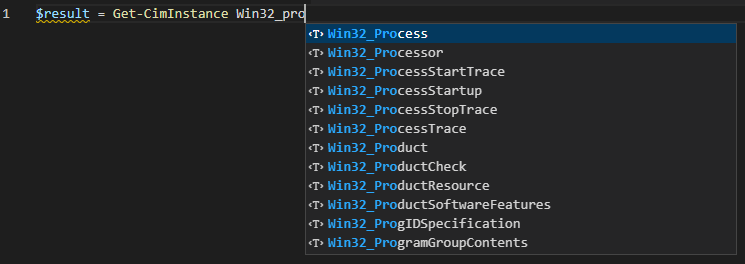
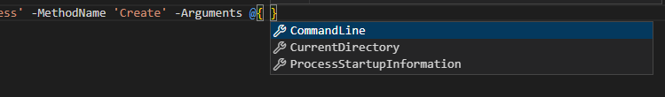
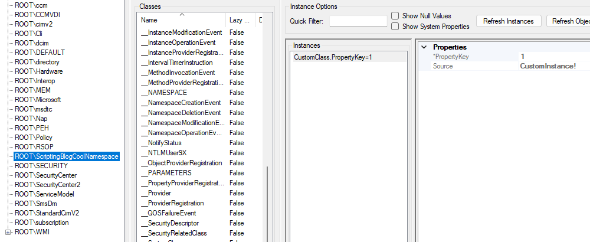

WMI is arguably one of the greatest tools a system administrator can have. You can manage Windows
workstations, interact with Microsoft products, like the Configuration Manager, monitor server's
resources and many more. Today, we are going to look at the different ways we can use WMI with
PowerShell. Hopefully, at the end, you will not have a favorite, but know what to use for each
occasion.

## The Ways

There are three tools for managing WMI I want to share with you.

- The **System.Management** namespace.
- The WMI Scripting API.
- The CIM cmdlets.

Wait, what about the WMI Cmdlets, like `Get-WmiObject`? There are two reasons we are not covering
these today. These commands are only available for Windows PowerShell, and you will come to learn
that the **System.Management** namespace is very similar. If you are still resisting trying
PowerShell 7, I could not recommend it enough.

## The Procedure

I want to cover tasks we face everyday while administering Windows devices. We will look at:

- Querying.
- Calling a WMI Class method.
- Creating, Updating and Deleting a WMI Class Instance.
- Bonus: Creating, Populating and Deleting a custom WMI Class.

I also want to show the pros and cons of each method, and where one stands out from the others.

## The System.Management Namespace

If I had to pick a favorite, it would be this one. Bringing an object-oriented "feel" to WMI, this
.NET namespace makes WMI management intuitive. Plus, if you are a C# developer, this will feel like
home.

### Querying

To perform a query, we need an instance of the **ManagementObjectSearcher** class.
There are three constructors worth looking at:

- `ManagementObjectSearcher(String)`
  - The simplest one. Creates a searcher object specifying the query string.
- `ManagementObjectSearcher(String, String)`
  - Creates the object with the query and the scope.
- `ManagementObjectSearcher(ManagementScope, ObjectQuery)`
  - The same as the previous one, but with instances of the objects instead of strings. This gives
    you more options.

Once we have the searcher, we call the **Get** method to return the **ManagementObjects**.

```powershell
$query = "Select * From Win32_Process Where Name = 'powershell.exe'"
$searcher = [wmisearcher]($query)
$result = $searcher.Get()
```

The `$result` variable holds an instance of the **ManagementObjectCollection** class.
This collection contains all the **Win32_Process** instances in the form of **ManagementObjects**.

```powershell
$result = $searcher.Get()
$result | Format-Table -Property ProcessId, Name, ExecutablePath -AutoSize

```Output
ProcessId Name           ExecutablePath
--------- ----           --------------
     4116 powershell.exe C:\Windows\System32\WindowsPowerShell\v1.0\powershell.exe
```

This is how it looks like using the second and third constructors.

```powershell
$query = "Select * From Win32_Process Where Name = 'powershell.exe'"
$scope = 'root\cimv2'
$searcher = [wmisearcher]::new($scope, $query)
$result = $searcher.Get()

# Or

$query = [System.Management.ObjectQuery]::new("Select * From Win32_Process Where Name = 'powershell.exe'")
$scope = [System.Management.ManagementScope]::new('root\cimv2')
$scope.Connect()
$searcher = [System.Management.ManagementObjectSearcher]::new($scope, $query)
$result = $searcher.Get()
```

### Calling a WMI Method

We could either call a method on the **ManagementObject** resultant from our query operation, like
**Terminate**, or call a method on the WMI Class object. Let's create a new process using the
**Create** method.

```powershell
$commandLine = 'powershell.exe -ExecutionPolicy Bypass -Command "Write-Output ''Howdy! From WMI!''; Read-Host"'
$processClass = [wmiclass]'Win32_Process'
# The parameters are: CommandLine, CurrentDirectory and ProcessStartupInformation.
$processClass.Create($commandLine, $null, $null)
```

If the method succeeds, you should be presented with a PowerShell console, and the **Output Parameters**:

```Output
__GENUS          : 2
__CLASS          : __PARAMETERS
__SUPERCLASS     :
__DYNASTY        : __PARAMETERS
__RELPATH        :
__PROPERTY_COUNT : 2
__PROPERTY_COUNT : 2
__DERIVATION     : {}
__SERVER         :
__NAMESPACE      :
__PATH           :
ProcessId        : 11896
ReturnValue      : 0
PSComputerName   :
```

### Creating, Updating and Deleting a WMI Class Instance

We are going to use the `ManagementClass.CreateInstance()` method to create a new instance of the
**SMS_Collection** class and **Put** to save it to the namespace.

```powershell
$collection = ([wmiclass]'root\SMS\site_PS1:SMS_Collection').CreateInstance()
$collection.Name = 'AwesomeDeviceCollection'
$collection.LimitingCollectionID = 'PS1000042'
$collection.Put()
# The Get() method updates the $collection object with the new
# property values populated by the Config Manager.
$collection.Get()
```

Updating and deleting.

```powershell
$collection = [wmiclass]"root\SMS\site_PS1:SMS_Collection.CollectionID='PS1000043'"
$collection.Name = 'AwesomeDeviceCollection_NewName'
$collection.Put()

# Deleting

$collection.Delete()
```

## The WMI Scripting API

The WMI Scripting API is nothing more than the exposure of the WMI COM interfaces through a Runtime
Callable Wrapper. Or WMI COM Object, for short. This method of managing WMI is not as straight
forward as the **System.Management** namespace, but its implementation gives great flexibility.

### Querying

To start, we need to instantiate a **SWbemLocator** object, which will be the interface to the other
objects, and obtain a **SWbemServices** object, by connecting to the server.

```powershell
$locator = New-Object -ComObject 'WbemScripting.SWbemLocator'
$services = $locator.ConnectServer()
```

Then, we use the **ExecQuery** method, from the **SWbemServices** object to perform our query. This
method returns a **SWbemObjectSet**, which is a collection of **SWbemObjects**. Its properties are
under the **Properties_** property.

```powershell
$result = $services.ExecQuery("Select * From Win32_Process Where Name = 'powershell.exe'")
$object = $result | Select-Object -First 1
$value = $object.Properties_['ProcessId'].Value
```

### Calling a WMI Method

First, we need to create an instance of the **__Properties** class, which holds the input parameters
for the **Create** method. Then, we use the `SWbemServices.ExecMethod()` method to call **Create**.

```powershell
$commandLine = 'powershell.exe -ExecutionPolicy Bypass -Command "Write-Output ''Howdy! From WMI!''; Read-Host"'
$parameters = $object.Methods_['Create'].InParameters.SpawnInstance_()
$parameters.Properties_['CommandLine'].Value = $commandLine

$output = $services.ExecMethod('Win32_Process', 'Create', $parameters)
```

The `$output` variable contains a **SWbemObject**, which is an instance of the **Output Parameters**
property class.

```powershell
$services.ExecMethod('Win32_Process', 'Create', $parameters)
```

```Output
Value       : 16172
Name        : ProcessId
IsLocal     : True
Origin      : __PARAMETERS
CIMType     : 19
Qualifiers_ : System.__ComObject
IsArray     : False

Value       : 0
Name        : ReturnValue
IsLocal     : True
Origin      : __PARAMETERS
CIMType     : 19
Qualifiers_ : System.__ComObject
IsArray     : False
```

### Creating, Updating and Deleting a WMI Class Instance

Let's replicate our last example using the Scripting API.

```powershell
$collection = $services.Get('\\.\root\SMS\site_PS1:SMS_Collection').SpawnInstance_()
$collection.Properties_['Name'].Value = 'AwesomeDeviceCollection'
$collection.Properties_['LimitingCollectionID'].Value = 'PS1000042'
$collection.Put_()
```

Updating and deleting.

```powershell
$collection = $services.Get("\\.\root\SMS\site_PS1:SMS_Collection.CollectionID='PS1000043'")
$collection.Properties_['Name'].Value = 'AwesomeDeviceCollection_NewName'
$collection.Put_()

# Deleting

$collection.Delete_()
```

## The CIM Cmdlets

When you just want to perform a WMI query to analyze data, and not necessarily interact with it, you
cannot beat the CIM Cmdlets. They are extremely fast, and provide unique tools like auto-complete
for class and namespace names and easy class retrival with `Get-CimClass`.

### Querying

Performing queries with the CIM Cmdlets is very pleasant. One line does it all.

```powershell
$result = Get-CimInstance -Query "Select * From Win32_Process Where Name = 'powershell.exe'"
```

The parameters are very similar to the `Get-WmiObject` ones, and can be used as follows.

```powershell
$result = Get-CimInstance -ClassName 'Win32_Process' -Filter "Name = 'powershell.exe'"
```

The _auto-complete_ feature in Visual Studio Code.



### Calling a WMI Method

The CIM Cmdlets introduces a unique way of calling WMI Methods. The results of a CIM query are
called **CimInstances**, and you cannot call instance methods like you would with the other two
options. Instead, you call another Cmdlet called `Invoke-CimMethod`.

```powershell
$commandLine = 'powershell.exe -ExecutionPolicy Bypass -Command "Write-Output ''Howdy! From WMI!''; Read-Host"'
$result = Get-CimClass -ClassName 'Win32_Process'
$params = @{
  MethodName = 'Create'
  Arguments = @{
    CommandLine = $commandLine
  }
}
$output = $result | Invoke-CimMethod @params

# Or
$params = @{
  ClassName = 'Win32_Process'
  MethodName = 'Create'
  Arguments = @{
    CommandLine = $commandLine
  }
}
$output = Invoke-CimMethod @params
```

And the result:

```powershell
Invoke-CimMethod -ClassName 'Win32_Process' -MethodName 'Create' -Arguments @{ CommandLine = $commandLine }
```

```Output
ProcessId ReturnValue PSComputerName
--------- ----------- --------------
    14932           0
```

Have a hard time remembering parameters? Me too! Luckily _auto-complete_ also works with them.



### Creating, Updating and Deleting a WMI Class Instance

If you used the old WMI Cmdlets before, this will look familiar.

```powershell
$params = @{
  Namespace = 'root\SMS\site_PS1'
  ClassName = 'SMS_Collection'
  Property = @{
    Name = 'AwesomeDeviceCollection'
    LimitingCollectionID = 'PS1000042'
  }
}
$collection = New-CimInstance @params
```

Updating and deleting.

```powershell
$params = @{
  Namespace = 'root\SMS\site_PS1'
  Query = "Select * From SMS_Collection Where Name = 'AwesomeDeviceCollection'"
  Property = @{
    Name = 'AwesomeDeviceCollection_NewName'
  }
}
Set-CimInstance @params

#Or

$params = @{
  Namespace = 'root\SMS\site_PS1'
  Query = "Select * From SMS_Collection Where Name = 'AwesomeDeviceCollection'"
}
$collection = Get-CimInstance @params
$collection | Set-CimInstance -Property @{
  Name = 'AwesomeDeviceCollection_NewName'
}

#Deleting

$params = @{
  Namespace = 'root\SMS\site_PS1'
  Query = "Select * From SMS_Collection Where Name = 'AwesomeDeviceCollection'"
}
$collection = Get-CimInstance @params
$collection | Remove-CimInstance
```

## Pros and Cons

- The **System.Management** namespace is great for acquiring instances of objects or classes. The
  aliases like `[wmi]` or `[wmiclass]` makes it easy to work with them, if you know their path.
  Calling methods is also very intuitive. In the other hand, querying and doing more complex
  operations can be time-consuming, and can involve more objects to keep track of.

- Using the WMI Scripting API is great when you have to build whole scripts to manage WMI. Once you
  have the **SWbemServices** object you can work with pretty much anything else. It is also
  rewarding performance-wise, compared to the previous method, since you are working with the RCW
  interfaces directly. The **System.Management** namespace will wrap these interfaces to provide
  abstraction. But this comes at a cost. If you want to retrieve single objects or perform queries
  to analyze data, this method can be a little annoying to work with.

- The CIM cmdlets are number one on performance when querying multiple-object datasets. The
  **CimInstance** object is great to work with, specially when combining with other known objects,
  like the **PSCustomObject**. On the other hand, calling methods is not as straight forward as on
  the previous methods. And to access methods like **Put**, **Get** or **Delete** can be
  challenging.

## Bonus

Let's create our own Namespace under root, and implement a custom class! We will use the
**System.Management** namespace, but now you can use what you learn to implement this using the
other methods as well.

```powershell
$namespace = ([wmiclass]'root:__Namespace').CreateInstance()
$namespace.Name = 'ScriptingBlogCoolNamespace'
$namespace.Put()
```

```Output
Path          : \\.\root:__NAMESPACE.Name="ScriptingBlogCoolNamespace"
RelativePath  : __NAMESPACE.Name="ScriptingBlogCoolNamespace"
Server        : .
NamespacePath : root
ClassName     : __NAMESPACE
IsClass       : False
IsInstance    : True
IsSingleton   : False
```

```powershell
$class = [wmiclass]::new('root\ScriptingBlogCoolNamespace', '', $null)
$class['__Class'] = 'CustomClass'
$class.Qualifiers.Add('Static', $true)
$class.Properties.Add('Source', 'Custom class with .NET!')
$class.Properties.Add('PropertyKey', 1)
## You need a Key property, otherwise WMI wouldn't be able to assemble the path of a new instance.
$class.Properties['PropertyKey'].Qualifiers.Add('Key', $true)
$class.Put()
```

```Output
Path          : \\.\root\ScriptingBlogCoolNamespace:CustomClass
RelativePath  : CustomClass
Server        : .
NamespacePath : root\ScriptingBlogCoolNamespace
ClassName     : CustomClass
IsClass       : True
IsInstance    : False
IsSingleton   : False
```

```powershell
$instance = ([wmiclass]'root\ScriptingBlogCoolNamespace:CustomClass').CreateInstance()
$instance.Source = 'CustomInstance!'
$instance.Put()
```

```Output
Path          : \\.\root\ScriptingBlogCoolNamespace:CustomClass.PropertyKey=1
RelativePath  : CustomClass.PropertyKey=1
Server        : .
NamespacePath : root\ScriptingBlogCoolNamespace
ClassName     : CustomClass
IsClass       : False
IsInstance    : True
IsSingleton   : False
```

And just like that, we have our own Namespace, Class and Instance!
The results on **WmiExplorer**.



## Conclusion

If you made it to the end, hopefully now you have the right tool for the right job, regarding WMI.
There is no winner, all of them are good in specific situations.
What they all have in common is that they, together, will make you a better System Administrator.

Thank you for following along on this journey, and I see you next time!

## Useful links

- [System.Management](https://docs.microsoft.com/en-us/dotnet/api/system.management?view=dotnet-plat-ext-6.0)
- [WMI Scripting API](https://docs.microsoft.com/en-us/windows/win32/wmisdk/scripting-api-for-wmi)
- [CIM Cmdlets](https://docs.microsoft.com/en-us/powershell/module/cimcmdlets/?view=powershell-7.2)
- [Runtime-Callable Wrapper](https://docs.microsoft.com/en-us/dotnet/standard/native-interop/runtime-callable-wrapper)
- [WMI Documentation](https://docs.microsoft.com/en-us/windows/win32/wmisdk/wmi-start-page)

See what I am up to!

[Github](https://github.com/FranciscoNabas)