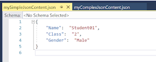

Hi Readers,

We will see in this post on how we can create a Json object and save it to a Json file using PowerShell.

1. Let's take a very simple Json example. The below section will generate a Json file via PowerShell that looks like below

```json
    {
        "Name":  "Student01",
        "Class":  "2",
        "Gender":  "Male"
    }
```

1. Create a string object. You may want to do it dynamically based on your requirement. I have taken a hard-coded string here for simplicity purpose.

1. Convert string object to a PSCustomObject using ConvertFrom-Json and then convert it back to Json string using ConvertTo-Json and save it in a Json file.

The code in PowerShell will look like this.

```powershell
    $mySimpleJsonString = "{Name:'Student01',Class:'2',Gender:'Male'}"
    
    $mySimplePSCustomObject = $mySimpleJsonString | ConvertFrom-Json
    $mySimpleJsonContent = $mySimplePSCustomObject | ConvertTo-Json 
    $mySimpleJsonContent > mySimpleJsonContent.json
```

When you will run above script, it will generate "mySimpleJsonContent.json" file which will look like below


Let's take another example of a complex Json. The generated Json file should have Json like below

```json
    [
        {
            "TargetType":  "Fruit",
            "TargetId":  [
                             "98e422be-d613-48e3-8453-16d2107ac77a"
                         ],
            "TargetMetadata":  {
                                   "Type":  "Citrus Fruit",
                                   "Name":  "Lemon"
                               }
        },
        {
            "TargetType":  "Vegetable",
            "TargetId":  [
                             "hde422be-d613-48e3-8453-16d2107ac77a"
                         ],
            "TargetMetadata":  {
                                   "Type":  "Leafy Vegetable",
                                   "Name":  "Coriander"
                               }
        }
    ]
```

The PowerShell script will look like this, and it will generate a "myComplexJsonContent.json" file. You will need to create the string object dynamically based on your requirement. I have taken a hard-coded string here for simplicity purpose.

```powershell
    $myComplexJsonString = 
    "[{
      TargetType: 'Fruit',
      TargetId: ['98e422be-d613-48e3-8453-16d2107ac77a'],
      TargetMetadata: {'Type': 'Citrus Fruit', 'Name': 'Lemon'}
    },
    {
      TargetType: 'Vegetable',
      TargetId: ['hde422be-d613-48e3-8453-16d2107ac77a'],
      TargetMetadata: {'Type': 'Leafy Vegetable', 'Name': 'Coriander'}
    }]"
    
    $myComplexPSCustomObject = $myComplexJsonString | ConvertFrom-Json
    $myComplexJsonContent = $myComplexPSCustomObject | ConvertTo-Json 
    $myComplexJsonContent > myComplexJsonContent.json
```


This is the full PowerShell script for both the examples.

```powershell
    $mySimpleJsonString = "{Name:'Student01',Class:'2',Gender:'Male'}"
    
    $mySimplePSCustomObject = $mySimpleJsonString | ConvertFrom-Json
    $mySimpleJsonContent = $mySimplePSCustomObject | ConvertTo-Json 
    $mySimpleJsonContent > mySimpleJsonContent.json
    
    
    $myComplexJsonString = 
    "[{
      TargetType: 'Fruit',
      TargetId: ['98e422be-d613-48e3-8453-16d2107ac77a'],
      TargetMetadata: {'Type': 'Citrus Fruit', 'Name': 'Lemon'}
    },
    {
      TargetType: 'Vegetable',
      TargetId: ['hde422be-d613-48e3-8453-16d2107ac77a'],
      TargetMetadata: {'Type': 'Leafy Vegetable', 'Name': 'Coriander'}
    }]"
    
    $myComplexPSCustomObject = $myComplexJsonString | ConvertFrom-Json
    $myComplexJsonContent = $myComplexPSCustomObject | ConvertTo-Json 
    $myComplexJsonContent > myComplexJsonContent.json
```

Let me know if this blog was helpful to you 🙂 Happy Scripting!!!