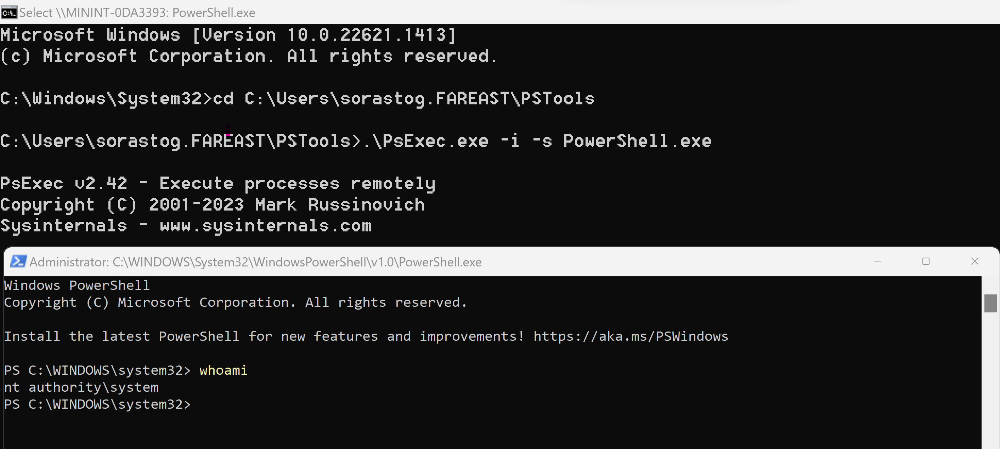
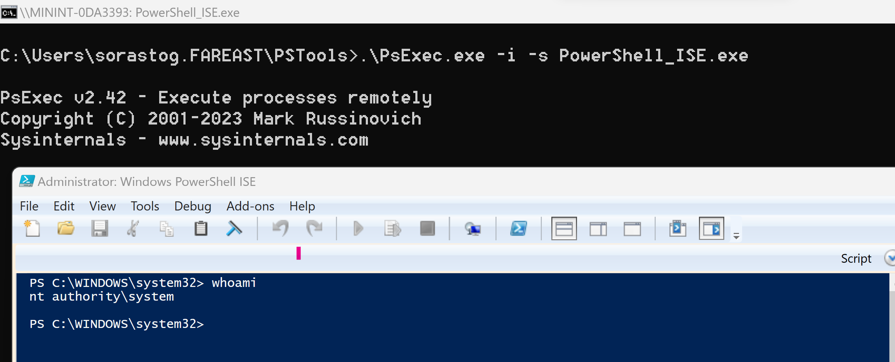

Hi Readers,

You will very frequently come into a scenario where you will need to run some commands using local system account.

In my case, I was working on a windows service which was running using local system account. The windows service internally was calling many PowerShell scripts.

I developed a new PowerShell script independently and it was absolutely working fine(running using my account which has elevated privileges), but when tested along with Windows Service, it failed due to various reasons like access and permission issues (as Windows service run scripts using local system account).

So to resolve this issue, I launched PowerShell with local system account, did required changes to code, performed complete testing and whoa I was all setup to go.

I thought to share all this information to you and save some of your time in troubleshooting.

## Steps to follow

### Initial Setup

1. Download PsExec from this [link](https://learn.microsoft.com/en-us/sysinternals/downloads/psexec).
1. It will ask you to download PSTools zip folder on your machine. Save it on your C:\ drive.
1. Extract the folder and copy the path.

### Open PowerShell with Local System Account

Open Command Prompt as **Administrator** and run below commands:

1. Change directory to PSTools folder.

```powershell
cd C:\PsTools
```

1. Invoke PowerShell using PsExec.exe

```powershell
.\PsExec.exe –i –s PowerShell.exe
```

1. The above step will launch PowerShell. Validate current user by executing "whoami"



### Open PowerShell ISE with Local System Account

Open Command Prompt as **Administrator** and run below commands:

1. Change directory to PSTools folder.

```powershell
cd C:\PsTools
```

1. Invoke PowerShell using PsExec.exe

```powershell
.\PsExec.exe –i –s PowerShell_Ise.exe
```

1. The above step will launch PowerShell ISE. Validate current user by executing "whoami"



Whoa! You are good to go. Do all your work and testing required to be done using Local System Account.

Happy Scripting!!!