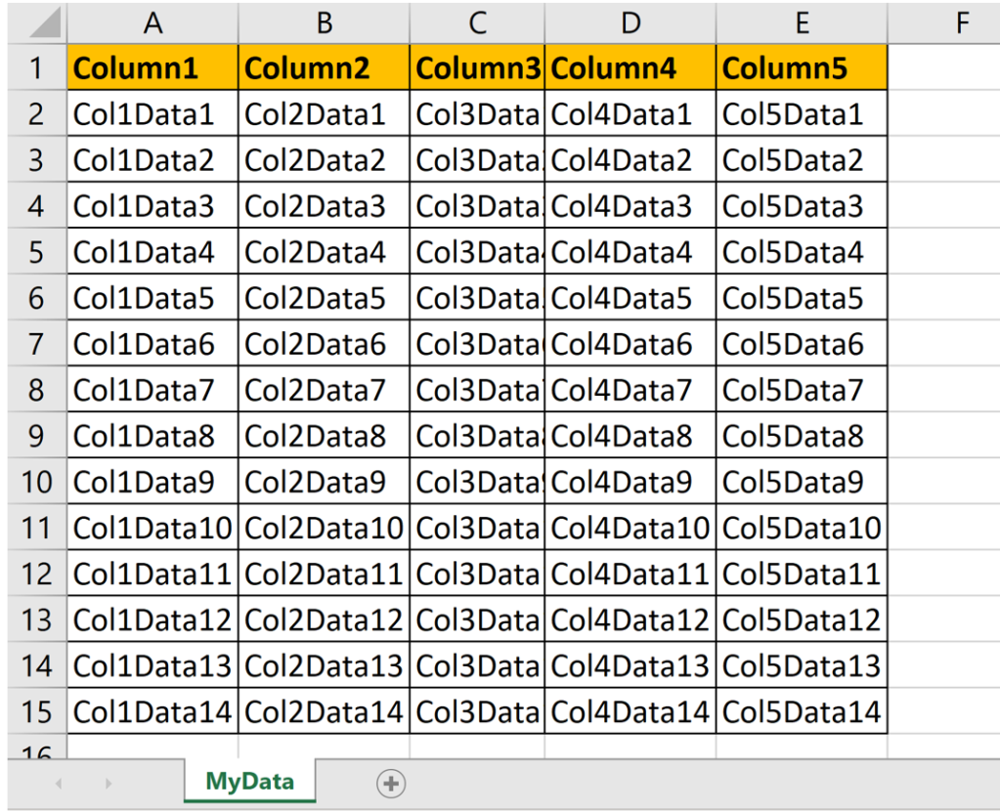
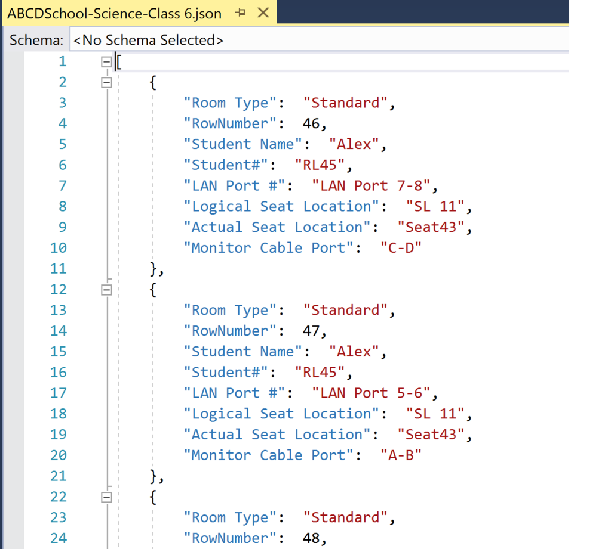

# Summary

There is an excellent [Github script](https://github.com/chrisbrownie/Convert-ExcelSheetToJson/blob/master/Convert-ExcelSheetToJson.ps1) available which helps in converting a full excel sheet to JSON. The table is from the start of the page i.e. from A1 cell (as shown in image below).



I had a little different requirement. I had to convert a specific table among various tables available within a sheet in an excel file as shown in image below.


Our requirement is to read Class 6 students data.
In above screenshot, there are multiple sheets within the excel workbook. There are multiple tables like Class1, Class2 …. Class 10 and so on inside the Science sheet.

As our requirement is to read Class 6 students data from Science sheet, lets look closely at how the data is available in excel sheet.

- Name of the class is at row 44.
- Column Header is at row 45.
- Data starts from row 46.

Note - The tables can be at any location (any column and any row) within the sheet. The only fixed identifier is TableName which is *Class 6* in this example.

## Steps to follow

Follow below steps to see how you can read Class 6 data from Science sheet:-

1. Input Parameters

The script accepts 3 parameters

- $InputFileFullPath: This is path of input excel file.
- $SubjectName: This is name of the sheet inside excel file.
- $ClassName: This is name of the table within excel sheet.

```powershell
$InputFileFullPath = "C:\Data\ABCDSchool.xlsx"
$SubjectName = "Science"
$ClassName = "Class 6"
```

1. Open excel file and read the *Science* sheet

```powershell
$excelApplication = New-Object -ComObject Excel.Application
$excelApplication.DisplayAlerts = $false
$Workbook = $excelApplication.Workbooks.Open($InputFileFullPath)

$sheet = $Workbook.Sheets | Where-Object {$_.Name -eq $SubjectName}
if (-not $sheet) {
    throw "Could not find subject '$SubjectName' in the workbook"
}
```

1. Grab *Class 6* table within *Science* sheet to work with

```powershell
$found = $sheet.Cells.Find($ClassName) #find the cell where Class name is mentioned
$beginAddress = $Found.Address(0,0,1,1).Split("!")[1]
$beginRowAddress = $beginAddress.Substring(1,2)
$startHeaderRowNumber = [int]$beginRowAddress + 1 #header row starts 1 row after the class name 
$startDataRowNumber = $startHeaderRowNumber + 1 #student data row starts 1 rows after header row
$beginColumnAddress = $beginAddress.Substring(0,1)
$startColumnHeaderNumber = [BYTE][CHAR]$beginColumnAddress - 65 + 1 #ASCII number of column
```

1. Extract Header Columns Name (Logical Seat Location, Actual Seat Location, LAN Port #, Monitor Cable Port, Student Name, Student#, Room Type)

```powershell
$Headers = @{}
$numberOfColumns = 0
$foundHeaderValue = $true
while ($foundHeaderValue -eq $true) {
    $headerCellValue = $sheet.Cells.Item($startHeaderRowNumber, $numberOfColumns+$startColumnHeaderNumber).Text 
    if ($headerCellValue.Trim().Length -eq 0) {
        $foundHeaderValue = $false
    } else {
        $numberOfColumns++
        if($Headers.ContainsValue($headerCellValue))
        {
            #do not add any duplicate column again.
        }
        else
        {            
            $Headers.$numberOfColumns = $headerCellValue
        }
    }
}
```

1. Extract Data Rows (Class 6 Student Information Rows)

```powershell
$rowNumber = $startDataRowNumber
$finish = $false
while($finish -eq $false)
{
    if ($rowNumber -gt 1) {
        $result = @{}        
        foreach ($columnNumber in $Headers.GetEnumerator()) {
            $columnName = $columnNumber.Value
            $cellValue = $sheet.Cells.Item($rowNumber, $columnNumber.Name+($startColumnHeaderNumber-1)).Value2 # student data row, student data column number
            if($cellValue -eq $null)
            {
                $finish = $true
                break;
            }
            $result.Add($columnName.Trim(),$cellValue.Trim())
        }
        if($finish -eq $false)
        {
            $result.Add("RowNumber",$rowNumber) #adding excel sheet row number for validation        
            $results += $result
            $rowNumber++
        }
    }
}
```

1. Create JSON file and close excel file

```powershell
$inputFileName = Split-Path $InputFileFullPath -leaf
$jsonOutputFileName = "$($inputFileName.Split(".")[0])-$SubjectName-$ClassName.json"
$jsonOutputFileFullPath = [System.IO.Path]::GetFullPath($jsonOutputFileName) #Output file name will be "ABCDSchool-Science-Class 6.json" 


Write-Host "Converting sheet '$SubjectName' to '$jsonOutputFileFullPath'"
$ignoreOutput = $results | ConvertTo-Json | Out-File -Encoding ASCII -FilePath $jsonOutputFileFullPath
$ignoreOutput = $excelApplication.Workbooks.Close()
$ignoreOutput = [void][System.Runtime.InteropServices.Marshal]::ReleaseComObject($excelApplication) 
```

## Output

Full code goes like this

```powershell
param 
(
    [Parameter(Mandatory=$true)]
    [string]$InputFileFullPath, #excel name
    [Parameter(Mandatory=$true)]
    [string]$SubjectName, #sheet name
    [Parameter(Mandatory=$true)]
    [string]$ClassName #identifier for the table
)

#open excel file
$excelApplication = New-Object -ComObject Excel.Application
$excelApplication.DisplayAlerts = $false
$Workbook = $excelApplication.Workbooks.Open($InputFileFullPath)

#find sheet
$sheet = $Workbook.Sheets | Where-Object {$_.Name -eq $SubjectName}
if (-not $sheet) {
    throw "Could not find subject '$SubjectName' in the workbook"
}
    
#grab the table within sheet to work with
$found = $sheet.Cells.Find($ClassName) #find the cell where Class name is mentioned
$beginAddress = $Found.Address(0,0,1,1).Split("!")[1]
$beginRowAddress = $beginAddress.Substring(1,2)
$startHeaderRowNumber = [int]$beginRowAddress + 2 #header row starts 1 row after the class name 
$startDataRowNumber = $startHeaderRowNumber + 1 #student data row starts 1 rows after header row
$beginColumnAddress = $beginAddress.Substring(0,1)
$startColumnHeaderNumber = [BYTE][CHAR]$beginColumnAddress - 65 + 1 #ASCII number of column
    
#Extract Header Columns Name
$Headers = @{}
$numberOfColumns = 0
$foundHeaderValue = $true
while ($foundHeaderValue -eq $true) {
    $headerCellValue = $sheet.Cells.Item($startHeaderRowNumber, $numberOfColumns+$startColumnHeaderNumber).Text 
    if ($headerCellValue.Trim().Length -eq 0) {
        $foundHeaderValue = $false
    } else {
        $numberOfColumns++
        if($Headers.ContainsValue($headerCellValue))
        {
            #do not add any duplicate column again.
        }
        else
        {            
            $Headers.$numberOfColumns = $headerCellValue
        }
    }
}
    
#Extract Student Information Rows
$results = @()
$rowNumber = $startDataRowNumber
$finish = $false
while($finish -eq $false)
{
    if ($rowNumber -gt 1) {
        $result = @{}        
        foreach ($columnNumber in $Headers.GetEnumerator()) {
            $columnName = $columnNumber.Value
            $cellValue = $sheet.Cells.Item($rowNumber, $columnNumber.Name+($startColumnHeaderNumber-1)).Value2 # student data row, student data column number
            if($cellValue -eq $null)
            {
                $finish = $true
                break;
            }
            $result.Add($columnName.Trim(),$cellValue.Trim())
        }
        if($finish -eq $false)
        {
            $result.Add("RowNumber",$rowNumber) #adding excel sheet row number for validation        
            $results += $result
            $rowNumber++
        }
    }
}
    
#input excel and output json file name
$inputFileName = Split-Path $InputFileFullPath -leaf
$jsonOutputFileName = "$($inputFileName.Split(".")[0])-$SubjectName-$ClassName.json"
$jsonOutputFileFullPath = [System.IO.Path]::GetFullPath($jsonOutputFileName)

#create json file and close excel file
Write-Host "Converting sheet '$SubjectName' to '$jsonOutputFileFullPath'"
$ignoreOutput = $results | ConvertTo-Json | Out-File -Encoding ASCII -FilePath $jsonOutputFileFullPath
$ignoreOutput = $excelApplication.Workbooks.Close()
$ignoreOutput = [void][System.Runtime.InteropServices.Marshal]::ReleaseComObject($excelApplication)    
```

The output JSON file will look like below


```json
[
    {
        "Room Type":  "Standard",
        "RowNumber":  46,
        "Student Name":  "Alex",
        "Student#":  "RL45",
        "LAN Port #":  "LAN Port 7-8",
        "Logical Seat Location":  "SL 11",
        "Actual Seat Location":  "Seat43",
        "Monitor Cable Port":  "C-D"
    },
    {
        "Room Type":  "Standard",
        "RowNumber":  47,
        "Student Name":  "Alex",
        "Student#":  "RL45",
        "LAN Port #":  "LAN Port 5-6",
        "Logical Seat Location":  "SL 11",
        "Actual Seat Location":  "Seat43",
        "Monitor Cable Port":  "A-B"
    },
    {
        "Room Type":  "Standard",
        "RowNumber":  48,
        "Student Name":  "John",
        "Student#":  "RL47",
        "LAN Port #":  "LAN Port 3-4",
        "Logical Seat Location":  "SL 11",
        "Actual Seat Location":  "Seat43",
        "Monitor Cable Port":  "C-D"
    },
    {
        "Room Type":  "Standard",
        "RowNumber":  49,
        "Student Name":  "John",
        "Student#":  "RL47",
        "LAN Port #":  "LAN Port 1-2",
        "Logical Seat Location":  "SL 11",
        "Actual Seat Location":  "Seat43",
        "Monitor Cable Port":  "A-B"
    },
    {
        "Room Type":  "Standard",
        "RowNumber":  50,
        "Student Name":  "Victor",
        "Student#":  "RL35",
        "LAN Port #":  "LAN Port 7-8",
        "Logical Seat Location":  "SL 10",
        "Actual Seat Location":  "Seat33",
        "Monitor Cable Port":  "C-D"
    },
    {
        "Room Type":  "Standard",
        "RowNumber":  51,
        "Student Name":  "Victor",
        "Student#":  "RL35",
        "LAN Port #":  "LAN Port 5-6",
        "Logical Seat Location":  "SL 10",
        "Actual Seat Location":  "Seat33",
        "Monitor Cable Port":  "A-B"
    },
    {
        "Room Type":  "Standard",
        "RowNumber":  52,
        "Student Name":  "Honey",
        "Student#":  "RL42",
        "LAN Port #":  "LAN Port 3-4",
        "Logical Seat Location":  "SL 10",
        "Actual Seat Location":  "Seat33",
        "Monitor Cable Port":  "C-D"
    }
]
```

Feel free to drop your feedback and inputs on this page. Till then, Happy Scripting!!!