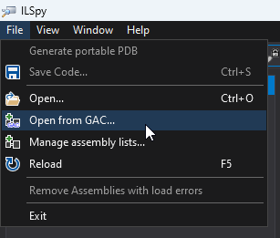
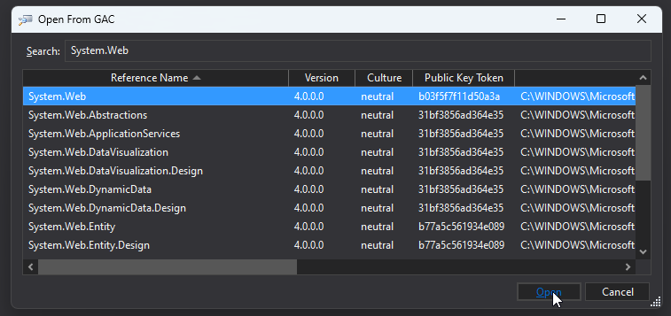
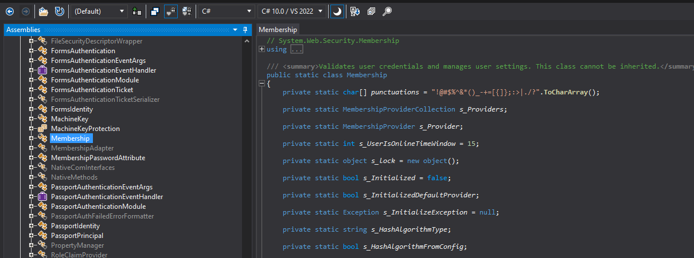
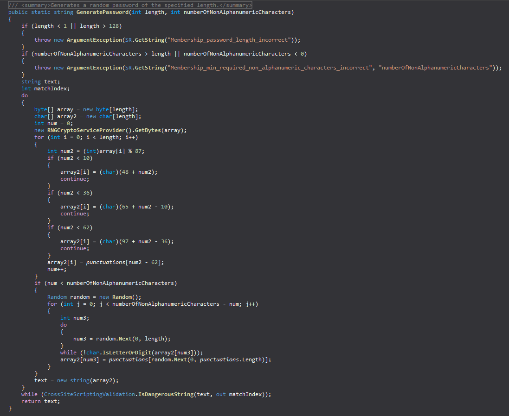

I've been using PowerShell (core) for a couple of years now, and it became natural to create
automations with all the features that are not present in Windows PowerShell.<br>
However, there is still one feature I miss in PowerShell, and this feature,
for as silly as it sounds, is the **GeneratePassword**, from **System.Web.Security.Membership**.<br>
This happens because this assembly was developed in .NET Framework, and not brought to .NET (core).<br>
Although there are multiple alternatives to achieve the same result, 
I thought this is the perfect opportunity to show the Power in PowerShell, and port this method from C#.

## Method

We are going to get this method's code by using an IL decompiler.<br>
C# is compiled to an **Intermediate Language**, which allows us to decompile it.<br>
The tool I'll be using is **ILSpy**, and can be found on the [Microsoft Store](https://www.microsoft.com/store/productId/9MXFBKFVSQ13).

Disclaimer: The code for **GeneratePassword** and the **System.Web** library were not written by me,
and the purpose of decompiling it is purely educational.<br>
For as harmless as this code is, it does not have any security warranties, nor is intended for misuse.

## Getting the Code

Once installed, open **ILSpy**, click on **File** and **Open from GAC...**.<br>
On the search bar, type **System.Web**, select the assembly, and click **Open**.




Once loaded, expand the **System.Web** assembly tree, and the **System.Web.Security** namespace.<br>
Inside **System.Web.Security**, look for the **Membership** class, click on it, and the decompiled
code should appear on the right pane.



Scroll down until you find the **GeneratePassword** method, and expand it.




## Porting to PowerShell

Now the fun begins. Let's do this using PowerShell tools only, means we're not going to copy the
**Membership** class and method.<br>
We are going to create a function, and keep the variable names the same, so it's easier for us to compare.

- Starting with the method's signature: **public static string GeneratePassword(int lenght, int
  numberOfNonAlphanumericCharacters)**. **public** means this method can be called from outside the
  assembly. **static** means I can call this method without having to instantiate an object of type
  **Membership**. **string** means this method returns a string.
- Utility methods and properties. **GeneratePassword** uses methods and properties that are also
  defined in the **System.Web** library.
  - Methods
    - System.Web.CrossSiteScriptingValidation.IsDangerousString(string s, out int matchIndex)
    - System.Web.CrossSiteScriptingValidation.IsAtoZ(char c)
  - Properties
    - char[] punctuations, from System.Web.Security.Membership
    - char[] startingChars, from System.Web.CrossSiteScriptingValidation

Now enough C#, let get to scripting.

### Main function

For this, we are going to use the **Advanced Function** template, from Visual Studio Code.<br>
I'll name the main function `New-StrongPassword`, but you can name it as you like,
just remember using approved verbs.<br>
<br>
This method takes as parameter two integer numbers, let's create them in the `param()` block.<br>
The first two `if` statements are checks to ensure both parameters are within acceptable range.<br>
We can accomplish the same with parameter attributes.<br>

```powershell
function New-StrongPassword {
    
    [CmdletBinding()]
    param (
        
        # Number of characters.
        [Parameter(
            Mandatory,
            Position = 0,
            HelpMessage = 'The number of characters the password should have.'
        )]
        [ValidateRange(1, 128)]
        [int] $Length,

        # Number of non alpha-numeric chars.
        [Parameter(
            Mandatory,
            Position = 1,
            HelpMessage = 'The number of non alpha-numeric characters the password should contain.'
        )]
        [ValidateScript({
            if ($PSItem -gt $Length -or $PSItem -lt 0) {
                throw New-Object -TypeName 'System.ArgumentException' -ArgumentList 'Membership minimum required non alpha-numeric characters is incorrect'
            }
            return $true
        })]
        [int] $NumberOfNonAlphaNumericCharacters

    )
    
    begin {
        
    }
    
    process {
        
    }
    
    end {
        
    }
}
```

### Utilities

Now let's focus on the `Begin{}` block, and create those utility methods, and properties.

#### Properties
These are the two properties, in our case variables, that we need to create.

```csharp
private static char[] startingChars = new char[2] { '<', '&' };
private static char[] punctuations = "!@#$%^&*()_-+=[{]};:>|./?".ToCharArray();
```

Let's create them as global variables, to be used across our functions if necessary.

```powershell
[char[]]$Global:punctuations = @('!', '@', '#', '$', '%', '^', '&', '*', '(', ')', '_', '-', '+', '=', '[', '{', ']', '}', ';', ':', '>', '|', '.', '/', '?')
[char[]]$Global:startingChars = @('<', '&')
```

#### Get-IsAtoZ
This is what the method looks like:

```csharp
private static bool IsAtoZ(char c)
{
	if (c < 'a' || c > 'z')
	{
		if (c >= 'A')
		{
			return c <= 'Z';
		}
		return false;
	}
	return true;
}
```

Pretty simple method, with one parameter, only the operator's name needs to change.<br>
Let's use an inline function:

```powershell
function Get-IsAToZ([char]$c) {
    if ($c -lt 'a' -or $c -gt 'z') {
        if ($c -ge 'A') {
            return $c -le 'Z'
        }
        return $false
    }
    return $true
}
```

#### Get-IsDangerousString

This is what the C# method looks like:

```csharp
internal static bool IsDangerousString(string s, out int matchIndex)
{
	matchIndex = 0;
	int startIndex = 0;
	while (true)
	{
		int num = s.IndexOfAny(startingChars, startIndex);
		if (num < 0)
		{
			return false;
		}
		if (num == s.Length - 1)
		{
			break;
		}
		matchIndex = num;
		switch (s[num])
		{
		case '<':
			if (IsAtoZ(s[num + 1]) || s[num + 1] == '!' || s[num + 1] == '/' || s[num + 1] == '?')
			{
				return true;
			}
			break;
		case '&':
			if (s[num + 1] == '#')
			{
				return true;
			}
			break;
		}
		startIndex = num + 1;
	}
	return false;
}
```

This one is a little more extensive, but it's pretty much only string manipulation.<br>
The interesting part of this method though, is the parameter `matchIndex`.<br>
Note the **out** keyword, this means this parameter is passed as reference.<br>
We could skip this parameter altogether, because is not used in our case,
but this is a perfect opportunity to exercise the **PSReference** type.
  
```powershell
function Get-IsDangerousString {

    param([string]$s, [ref]$matchIndex)

    # To access the referenced parameter's value, we use the 'Value' property from PSReference.
    $matchIndex.Value = 0
    $startIndex = 0

    while ($true) {
        $num = $s.IndexOfAny($Global:startingChars, $startIndex)
        if ($num -lt 0) {
            return $false
        }
        if ($num -eq $s.Length - 1) {
            break
        }
        $matchIndex.Value = $num

        switch ($s[$num]) {
            '<' {
                if ((Get-IsAToZ($s[$num + 1])) -or $s[$num + 1] -eq '!' -or $s[$num + 1] -eq '/' -or $s[$num + 1] -eq '?') {
                    return $true
                }
            }
            '&' {
                if ($s[$num + 1] -eq '#') {
                    return $true
                }
            }
        }
        $startIndex = $num + 1
    }
    return $false
}
```

With these, our `Begin{}` block looks like this:

```powershell
Begin {
    [char[]]$Global:punctuations = @('!', '@', '#', '$', '%', '^', '&', '*', '(', ')', '_', '-', '+', '=', '[', '{', ']', '}', ';', ':', '>', '|', '.', '/', '?')
    [char[]]$Global:startingChars = @('<', '&')

    function Get-IsAToZ([char]$c) {
        if ($c -lt 'a' -or $c -gt 'z') {
            if ($c -ge 'A') {
                return $c -le 'Z'
            }
            return $false
        }
        return $true
    }

    function Get-IsDangerousString {

        param([string]$s, [ref]$matchIndex)

        $matchIndex.Value = 0
        $startIndex = 0

        while ($true) {
            $num = $s.IndexOfAny($Global:startingChars, $startIndex)
            if ($num -lt 0) {
                return $false
            }
            if ($num -eq $s.Length - 1) {
                break
            }
            $matchIndex.Value = $num

            switch ($s[$num]) {
                '<' {
                    if ((Get-IsAToZ($s[$num + 1])) -or $s[$num + 1] -eq '!' -or $s[$num + 1] -eq '/' -or $s[$num + 1] -eq '?') {
                        return $true
                    }
                }
                '&' {
                    if ($s[$num + 1] -eq '#') {
                        return $true
                    }
                }
            }
            $startIndex = $num + 1
        }
        return $false
    }
}
```

### Main Function Body

In this stage we build the function itself. Since we're using attributes to check the parameters,
the first two `if` statements are ignored.<br>
After that, we have a single `do-while` loop. In this loop, we are going to use tools from
the **System.Security.Cryptography** library, so let's import it.

```powershell
Add-Type -AssemblyName System.Security.Cryptography

# If you get 'Assembly cannot be found' errors, load it with partial name instead.
[void][System.Reflection.Assembly]::LoadWithPartialName('System.Security.Cryptography')
```

First let's declare the variables used in the main function body, and inside the main loop.<br>
This gives us the opportunity to analyze our choices.<br>

```powershell
# Explicitly declaring the output 'text' to match the method. We can skip this delaration.
# Same for the 'matchIndex'
$text = [string]::Empty
$matchIndex = 0
do {
    $array = New-Object -TypeName 'System.Byte[]' -ArgumentList $Length
    $array2 = New-Object -TypeName 'System.Char[]' -ArgumentList $Length
    $num = 0
            
    # This stage could be done in 3 ways. We could use 'New-Object' and imediately call 'GetBytes' on it,
    # we could use the class constructor directly, and call 'GetBytes' on it: [System.Security.Cryptography.RNGCryptoServiceProvider]::new().GetBytes(),
    # or we could instantiate the 'RNGCryptoServiceProvider' object using one of the previous methods, and call 'GetBytes' on it.
    # Since we're using PowerShell tools the most we can, and we want to stay true to the method, let's use the first option.
    # [void] used to suppress output.
    [void](New-Object -TypeName 'System.Security.Cryptography.RNGCryptoServiceProvider').GetBytes($array)
            

    # Note that when passing a variable as reference to a function parameter, we need to cast it to 'PSReference'.
    # The parenthesis is necessary so the parameter uses the object, and not use it as a string.
} while ((Get-IsDangerousString -s $text -matchIndex ([ref]$matchIndex)))
```

Note that in our pursuit to stay true to the method's layout, we are including extra declarations.<br>
Although this could be avoided, in some cases it helps with script readability.<br>
Plus, if you have experience with any programming language, this will feel familiar.<br>

Right after that, we have a `for` loop which will choose each character for our password.<br>
It does this with a series of mathematical operations, and comparisons.<br>

```powershell
for ($i = 0; $i -lt $Length; $i++) {
    $num2 = [int]$array[$i] % 87
    if ($num2 -lt 10) {
        $array2[$i] = [char](48 + $num2)
        continue
    }
    if ($num2 -lt 36) {
        $array2[$i] = [char](65 + $num2 - 10)
        continue
    }
    if ($num2 -lt 62) {
        $array2[$i] = [char](97 + $num2 - 36)
        continue
    }
    $array2[$i] = $Global:punctuations[$num2 - 62]
    $num++
}
```

The next session is going to manage our number of non-alphanumeric characters.<br>
It does that by generating random symbol characters and replacing values in the array we filled
in the previous loop.

```powershell
if ($num -lt $NumberOfNonAlphaNumericCharacters) {
    $random = New-Object -TypeName 'System.Random'
    
    # Generating only the characters left to complete our parameter specification.
    for ($j = 0; $j -lt $NumberOfNonAlphaNumericCharacters - $num; $j++) {
        $num3 = 0
        do {
            $num3 = $random.Next(0, $Length)
        } while (![char]::IsLetterOrDigit($array2[$num3]))
        $array2[$num3] = $Global:punctuations[$random.Next(0, $Global:punctuations.Length)]
    }
}
```

Now all that's left is to create a string from the character array, and check if it's safe with
`Get-IsDangerousString`.

```powershell
$text = [string]::new($array2)
```

If our `text` is safe, we return it and the function reaches end of execution.
Our finished function looks like this:

```powershell
function New-StrongPassword {
    
    [CmdletBinding()]
    param (
        
        # Number of characters.
        [Parameter(
            Mandatory,
            Position = 0,
            HelpMessage = 'The number of characters the password should have.'
        )]
        [ValidateRange(1, 128)]
        [int] $Length,

        # Number of non alpha-numeric chars.
        [Parameter(
            Mandatory,
            Position = 1,
            HelpMessage = 'The number of non alpha-numeric characters the password should contain.'
        )]
        [ValidateScript({
            if ($PSItem -gt $Length -or $PSItem -lt 0) {
                throw New-Object -TypeName 'System.ArgumentException' -ArgumentList 'Membership minimum required non alpha-numeric characters is incorrect'
            }
            return $true
        })]
        [int] $NumberOfNonAlphaNumericCharacters

    )
    
    Begin {
        [char[]]$Global:punctuations = @('!', '@', '#', '$', '%', '^', '&', '*', '(', ')', '_', '-', '+', '=', '[', '{', ']', '}', ';', ':', '>', '|', '.', '/', '?')
        [char[]]$Global:startingChars = @('<', '&')

        function Get-IsAToZ([char]$c) {
            if ($c -lt 'a' -or $c -gt 'z') {
                if ($c -ge 'A') {
                    return $c -le 'Z'
                }
                return $false
            }
            return $true
        }

        function Get-IsDangerousString {

            param([string]$s, [ref]$matchIndex)

            $matchIndex.Value = 0
            $startIndex = 0

            while ($true) {
                $num = $s.IndexOfAny($Global:startingChars, $startIndex)
                if ($num -lt 0) {
                    return $false
                }
                if ($num -eq $s.Length - 1) {
                    break
                }
                $matchIndex.Value = $num

                switch ($s[$num]) {
                    '<' {
                        if ((Get-IsAToZ($s[$num + 1])) -or $s[$num + 1] -eq '!' -or $s[$num + 1] -eq '/' -or $s[$num + 1] -eq '?') {
                            return $true
                        }
                    }
                    '&' {
                        if ($s[$num + 1] -eq '#') {
                            return $true
                        }
                    }
                }
                $startIndex = $num + 1
            }
            return $false
        }
    }
    
    Process {
        Add-Type -AssemblyName 'System.Security.Cryptography'

        $text = [string]::Empty
        $matchIndex = 0
        do {
            $array = New-Object -TypeName 'System.Byte[]' -ArgumentList $Length
            $array2 = New-Object -TypeName 'System.Char[]' -ArgumentList $Length
            $num = 0
            [void](New-Object -TypeName 'System.Security.Cryptography.RNGCryptoServiceProvider').GetBytes($array)
            
            for ($i = 0; $i -lt $Length; $i++) {
                $num2 = [int]$array[$i] % 87
                if ($num2 -lt 10) {
                    $array2[$i] = [char](48 + $num2)
                    continue
                }
                if ($num2 -lt 36) {
                    $array2[$i] = [char](65 + $num2 - 10)
                    continue
                }
                if ($num2 -lt 62) {
                    $array2[$i] = [char](97 + $num2 - 36)
                    continue
                }
                $array2[$i] = $Global:punctuations[$num2 - 62]
                $num++
            }

            if ($num -lt $NumberOfNonAlphaNumericCharacters) {
                $random = New-Object -TypeName 'System.Random'
                
                for ($j = 0; $j -lt $NumberOfNonAlphaNumericCharacters - $num; $j++) {
                    $num3 = 0
                    do {
                        $num3 = $random.Next(0, $Length)
                    } while (![char]::IsLetterOrDigit($array2[$num3]))
                    $array2[$num3] = $Global:punctuations[$random.Next(0, $Global:punctuations.Length)]
                }
            }

            $text = [string]::new($array2)
        } while ((Get-IsDangerousString -s $text -matchIndex ([ref]$matchIndex)))
    }

    End {
        return $text
    }
}
```

### Result

Now all that's left is to call our function:


## Conclusion

I hope you had as much fun as I had building this function.<br>
With this new skill, you can improve your scripts' complexity and reliability.<br>
This also makes you more comfortable to write your own modules, binary or not.<br>

Thank you for going along.
Happy scripting!

## Links

[ILSpy GitHub page](https://github.com/icsharpcode/ILSpy)<br>
[Test our WindowsUtils module!](https://github.com/FranciscoNabas/WindowsUtils)<br>
[See what I'm up to](https://github.com/FranciscoNabas)